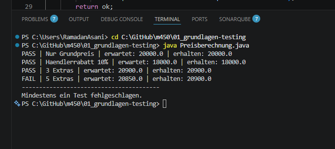
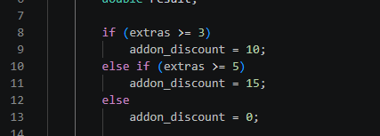
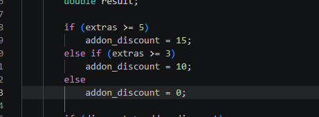
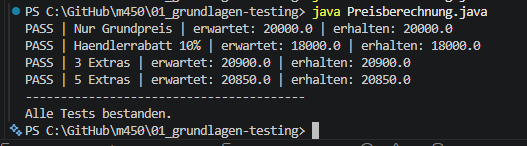

# Modul 450 – Grundlagen zu Testing

Bearbeitet von: Ramadan Asani

---

## Aufgabe 1 – Testformen in der Informatik

Drei Testarten, die ich aus der Praxis kenne (Beispiele aus unserem NoQui-Quiz-Projekt):

**1. Unit-Test**
Prüft eine einzelne Methode isoliert, z. B. die Punkteberechnung im Backend.
Durchführung: automatisiert mit einem Testframework (z. B. JUnit oder Jest). Der Test ruft die Methode mit festen Eingaben auf und vergleicht das Resultat mit dem erwarteten Wert.

**2. Integrationstest**
Prüft, ob mehrere Komponenten zusammenspielen, z. B. ob das Frontend die Fragen korrekt vom Backend lädt.
Durchführung: manuell mit einem REST-Client wie Postman oder automatisiert mit einem Test, der Frontend und Backend zusammen prüft.

**3. Systemtest (End-to-End)**
Prüft das ganze System, z. B. einen kompletten Quiz-Durchlauf: Raum erstellen, beitreten, Fragen beantworten, Rangliste anschauen.
Durchführung: manuell nach einer Testfall-Liste oder automatisiert mit einem Browser-Tool wie Cypress oder Selenium.

---

## Aufgabe 2 – Fehler, Mangel und hoher Schaden

**Beispiel für einen Fehler**
Im NoQui-Quiz berechnet das System bei einer richtigen Antwort 0 statt der erwarteten Punkte. Das SOLL-Verhalten (Punkte gutschreiben) weicht vom IST-Verhalten (keine Punkte) ab. Eine Anforderung wird also nicht erfüllt → Fehler.

**Beispiel für einen Mangel**
Die Punkte werden korrekt berechnet, aber in der Rangliste falsch dargestellt (z. B. abgeschnitten oder in falscher Reihenfolge angezeigt). Die Berechnung stimmt, nur die Erwartung an eine saubere Anzeige wird nicht angemessen erfüllt → Mangel.

**Beispiel für einen hohen Schaden bei einem Fehler**
Bei einer Software für ein Bremssystem im Auto: Ein Fehler in der Steuerung kann dazu führen, dass die Bremse nicht auslöst. Das gefährdet Menschenleben. Solche Systeme müssen deshalb viel ausgiebiger getestet werden als z. B. ein Quiz-Spiel.

---

## Aufgabe 3 – Preisberechnung mit Testtreiber

Der Code der Methode `calculatePrice` wurde in der Datei `Preisberechnung.java` umgesetzt.

Ein Testtreiber ist ein kleines Programm, das die zu testende Methode mit verschiedenen Eingaben aufruft und das Resultat mit dem erwarteten Wert vergleicht. Wir schreiben hier bewusst noch keine Unit-Tests, sondern eine eigene main-Methode, die mehrere Fälle durchprüft und pro Fall PASS oder FAIL ausgibt.

Getestete Fälle:
1. Nur Grundpreis ohne Rabatt
2. Grundpreis mit Händlerrabatt
3. 3 Extras (10% Rabatt auf Zubehör)
4. 5 Extras (sollten 15% Rabatt auf Zubehör sein)

Test 4 ist beim ersten Durchlauf fehlgeschlagen. Damit hat der Testtreiber den Fehler im Code aufgedeckt.

### Bonus: Fehler im Code

Der Fehler liegt in der Reihenfolge der Bedingungen (Zeile 8–13):

    if (extras >= 3)
        addon_discount = 10;
    else if (extras >= 5)
        addon_discount = 15;

Weil `extras >= 3` zuerst geprüft wird, ist diese Bedingung schon bei 5 Extras erfüllt. Der Zweig `extras >= 5` wird dadurch nie erreicht, der 15%-Rabatt kommt nie zum Einsatz.

Korrektur: Die grössere Bedingung muss zuerst geprüft werden:

    if (extras >= 5)
        addon_discount = 15;
    else if (extras >= 3)
        addon_discount = 10;
    else
        addon_discount = 0;

Nach der Korrektur läuft auch Test 4 als PASS durch.

### Screenshots zu Aufgabe 3

**Vorher:** Der Testtreiber deckt den Fehler auf – Test 4 (5 Extras) schlägt fehl:

**Fehler im Code (Zeile 8–13):** Die Bedingung `extras >= 3` wird zuerst geprüft und ist bei 5 Extras schon erfüllt. Der Zweig `extras >= 5` wird nie erreicht, der 15%-Rabatt greift nicht:

**Korrektur:** Die grössere Bedingung wird zuerst geprüft:

**Nachher:** Nach der Korrektur bestehen alle Tests:

