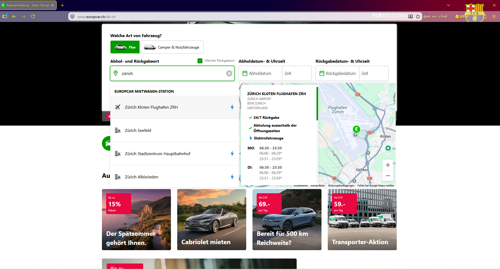
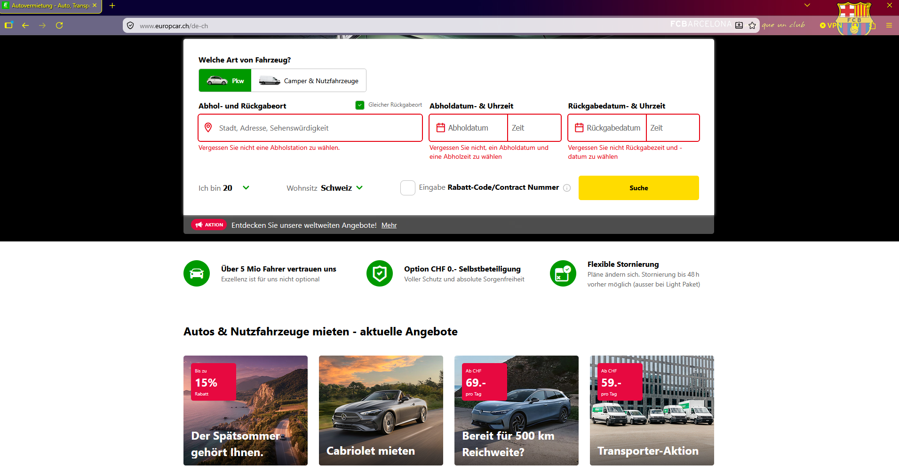
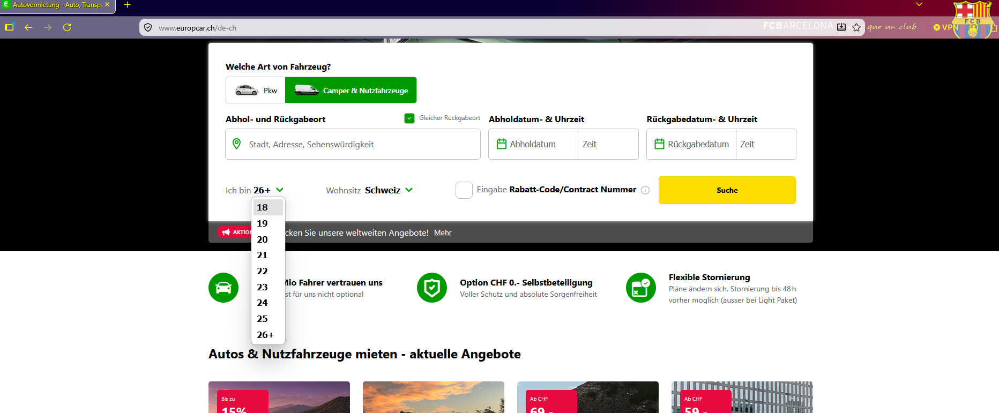
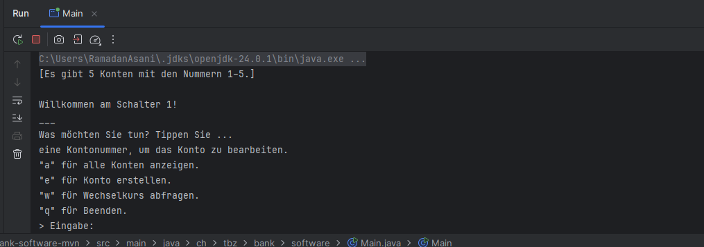
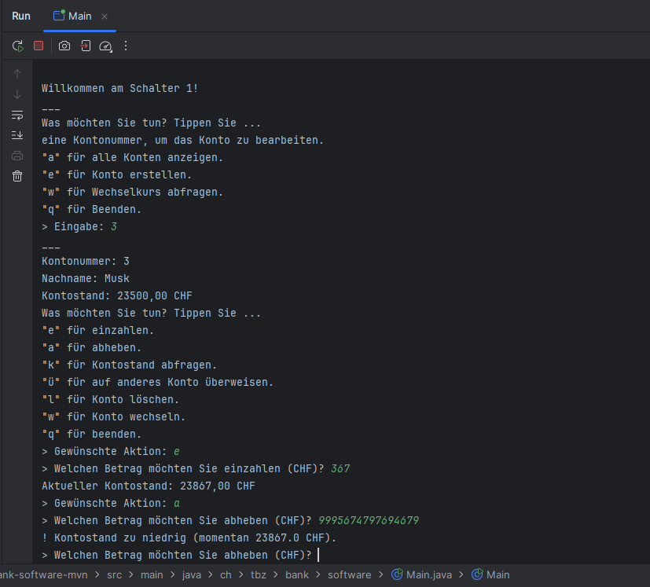
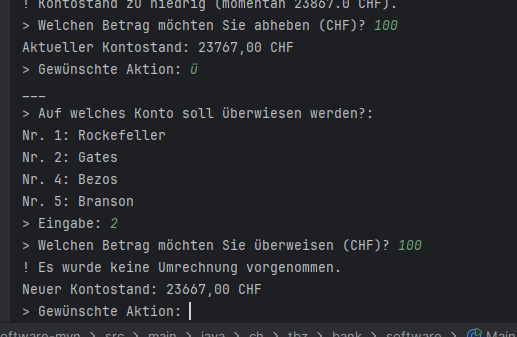

# Modul 450 – Teststrategie

Bearbeitet von: Ramadan Asani

---

## Übung 1 – Testfälle aus Rabattregeln ableiten

Aus der Beschreibung ergeben sich vier Preisbereiche mit unterschiedlichem Rabatt:

- Kaufpreis unter 15'000 CHF → kein Rabatt (0%)
- Kaufpreis 15'000 bis 20'000 CHF → 5%
- Kaufpreis über 20'000 und unter 25'000 CHF → 7%
- Kaufpreis ab 25'000 CHF → 8,5%

### Abstrakte Testfälle

Hier wird mit logischen Operatoren statt konkreten Zahlen gearbeitet.

| ID  | Bedingung (Kaufpreis)   | Erwarteter Rabatt |
| --- | ----------------------- | ----------------- |
| A1  | preis < 15'000          | 0%                |
| A2  | 15'000 ≤ preis ≤ 20'000 | 5%                |
| A3  | 20'000 < preis < 25'000 | 7%                |
| A4  | preis ≥ 25'000          | 8,5%              |

### Konkrete Testfälle

Hier werden echte Eingabewerte verwendet. Bewusst an den Grenzen gewählt, weil dort am ehesten Fehler auftreten (Grenzwertanalyse).

| ID  | Kaufpreis (CHF) | Erwarteter Rabatt |
| --- | --------------- | ----------------- |
| K1  | 10'000          | 0%                |
| K2  | 14'999          | 0%                |
| K3  | 15'000          | 5%                |
| K4  | 20'000          | 5%                |
| K5  | 20'001          | 7%                |
| K6  | 24'999          | 7%                |
| K7  | 25'000          | 8,5%              |
| K8  | 30'000          | 8,5%              |

---

## Übung 2 – Funktionale Black-Box-Testfälle Autovermietung

Getestete Webseite: Europcar Schweiz ([www.europcar.ch](https://www.europcar.ch))

Es handelt sich um Black-Box-Tests: Getestet wird nur das sichtbare Verhalten der Webseite als Benutzer, ohne den Code zu kennen. Die Testfälle beziehen sich auf tatsächlich vorhandene Funktionen der Seite (Online-Buchung mit Stationsauswahl, Fahrzeugart, Fahreralter).

| ID  | Beschreibung                                                  | Erwartetes Resultat                                                                         | Effektives Resultat | Status | Mögliche Ursache |
| --- | ------------------------------------------------------------- | ------------------------------------------------------------------------------------------- | ------------------- | ------ | ---------------- |
| 1   | Startseite aufrufen                                           | Die Seite lädt und zeigt die Buchungsmaske mit Feldern für Ort, Abhol- und Rückgabedatum an | Wie erwartet        | OK     | –                |
| 2   | Abhol-/Rückgabeort (z. B. Zürich) eingeben                    | Es werden passende Europcar-Stationen zur Auswahl angezeigt                                 | Wie erwartet        | OK     | –                |
| 3   | Auf "Suche" klicken, ohne Ort und Datum einzugeben            | Die Suche startet nicht; es werden Hinweise auf die fehlenden Pflichtfelder angezeigt       | Wie erwartet        | OK     | –                |
| 4   | Fahrzeugart von "Pkw" auf "Camper & Nutzfahrzeuge" umschalten | Die Auswahl wechselt sichtbar auf Camper & Nutzfahrzeuge                                    | Wie erwartet        | OK     | –                |
| 5   | Bei "Ich bin 26+" das Fahreralter ändern                      | Es öffnet sich eine Auswahl mit Altersstufen von 18 bis 26+                                 | Wie erwartet        | OK     | –                |

### Nachweise (Screenshots)

**Testfall 1 – Startseite mit Buchungsmaske:**

**Testfall 2 – Ort "Zürich" eingegeben, Stationen werden angezeigt:**

**Testfall 3 – Suche ohne Ort und Datum, Hinweise auf Pflichtfelder:**

**Testfall 4 – Umschalten auf Camper & Nutzfahrzeuge:**

**Testfall 5 – Fahreralter ändern (Auswahl 18 bis 26+):**

---

## Übung 3 – Analyse der Bank-Software

Die Bank-Software ist eine Konsolen-Applikation, die einen Bankschalter simuliert. Beim Start werden fünf Konten angelegt. Über ein Menü kann man Konten anzeigen, erstellen, Geld einzahlen, abheben, auf andere Konten überweisen, Konten löschen und Wechselkurse abfragen.

### Applikation läuft

Die Applikation wurde in IntelliJ als Maven-Projekt geöffnet und über `Main.java` gestartet. Beim Start werden die fünf Konten (Nummern 1–5) angezeigt und das Schalter-Menü erscheint.

### Black-Box-Testfälle (als Benutzer)

Diese Testfälle können ohne Kenntnis des Codes über die Konsole getestet werden.

| ID  | Beschreibung                            | Erwartetes Resultat                                            | Effektives Resultat                                       | Status |
| --- | --------------------------------------- | ------------------------------------------------------------- | --------------------------------------------------------- | ------ |
| 1   | Konto mit gültiger Nummer (3) wählen    | Kontodetails von Musk (23500 CHF) werden angezeigt            | Wie erwartet                                              | OK     |
| 2   | Konto mit ungültiger Nummer (99) wählen | Meldung "Ein Konto mit dieser Nummer ist nicht vorhanden"     | Wie erwartet                                              | OK     |
| 3   | Betrag einzahlen (367)                  | Kontostand erhöht sich korrekt                                | Wie erwartet                                              | OK     |
| 4   | Mehr abheben als vorhanden              | Meldung "Kontostand zu niedrig", keine Abhebung               | Wie erwartet                                              | OK     |
| 5   | Buchstabe statt Betrag eingeben         | Meldung "Ungültige Eingabe, bitte nochmals"                   | Wie erwartet                                              | OK     |
| 6   | Überweisung CHF-Konto → EUR-Konto (100) | Betrag sollte in EUR umgerechnet werden                       | Es wird NICHT umgerechnet, 100 werden 1:1 gutgeschrieben  | Fehler |

### Nachweis Testdurchlauf

Einzahlung und Abheben über dem Kontostand:

### Gefundener Fehler: fehlende Währungsumrechnung

Bei einer Überweisung von einem CHF-Konto auf ein EUR-Konto wird der Betrag nicht umgerechnet. Das Programm gibt "Es wurde keine Umrechnung vorgenommen" aus und schreibt den Betrag unverändert gut.

**Ursache:** Die Methode `convertCurrency` in `Counter.java` deckt nur drei Währungsrichtungen ab: USD→CHF, USD→EUR und CHF→USD. Alle anderen Kombinationen (z. B. CHF→EUR, EUR→CHF, EUR→USD) fallen durch und geben den Betrag ohne Umrechnung zurück. In einer echten Bank-Software ist das ein schwerwiegender Fehler, weil dadurch Geldwerte verfälscht werden.

### White-Box-Testfälle (Methoden im Code)

Diese Methoden eignen sich gut für gezielte Unit-Tests, weil sie eine klare Logik mit Ein- und Ausgabe haben:

| Methode                    | Klasse  | Warum testbar                                                     |
| -------------------------- | ------- | ---------------------------------------------------------------- |
| `withdraw(double amount)`  | Account | Gibt true/false zurück; Grenzfall Betrag = Kontostand gut prüfbar |
| `deposit(double amount)`   | Account | Kontostand muss sich korrekt erhöhen                             |
| `convertCurrency(...)`     | Counter | Umrechnung pro Währungspaar prüfbar; deckt den gefundenen Fehler auf |
| `getAccount(int nr)`       | Bank    | Muss richtiges Konto oder null zurückgeben                       |

### Verbesserungsvorschläge / Best Practices

- **Währungsumrechnung vervollständigen:** Alle Währungspaare abdecken oder besser über die vorhandene Wechselkurs-API rechnen, statt fixe Ratios im Code.
- **Tippfehler korrigieren:** Die Klasse heisst `AccountExeption` statt `AccountException`.
- **API-Key nicht im Code:** In `ExchangeRateOkhttp` steht ein API-Key direkt im Quellcode. Solche Geheimnisse gehören in eine Konfigurationsdatei oder Umgebungsvariable, nicht ins Repository.
- **Magic Numbers vermeiden:** Die festen Umrechnungskurse als benannte Konstanten oder aus einer Quelle laden.
- **Trennung von Logik und Ein-/Ausgabe:** Die Klasse `Counter` mischt Benutzereingaben (Scanner) mit Geschäftslogik. Eine sauberere Trennung würde Unit-Tests erleichtern.
- **Konsistente Fehlermeldung:** Im Menü wird bei ungültiger Eingabe "a, e, u oder q" genannt, obwohl die Option "w" (nicht "u") heisst.