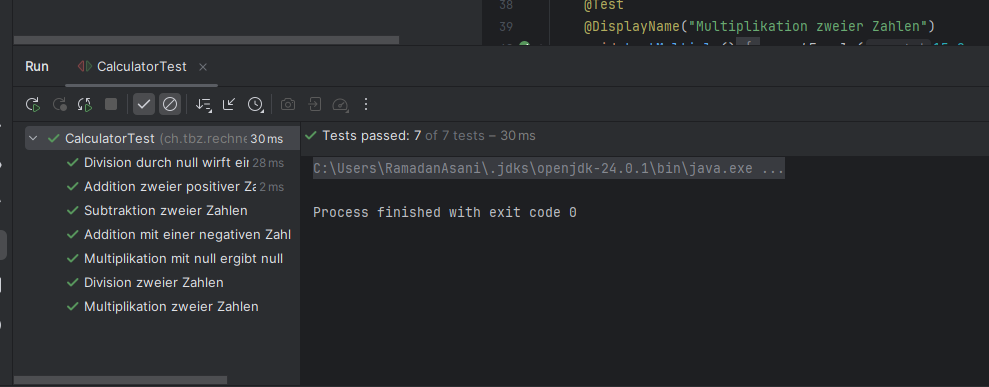
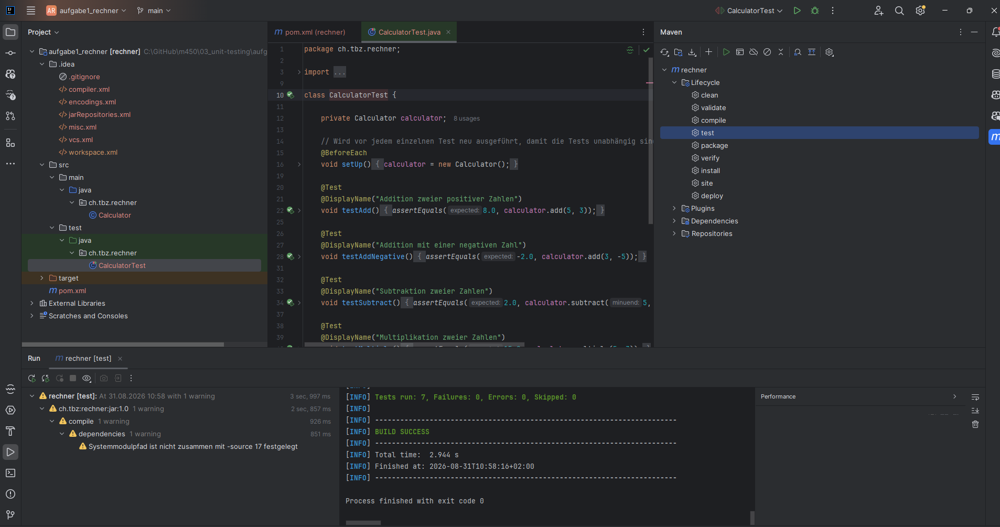

# Modul 450 – Unit Testing

Bearbeitet von: Ramadan Asani

---

## Aufgabe 1 – Simpler Rechner mit JUnit

Es wurde ein Maven-Projekt mit einer `Calculator`-Klasse erstellt, die die vier Grundrechenarten enthält (`add`, `subtract`, `multiply`, `divide`). Für die Division wird der Sonderfall "Division durch null" mit einer Exception abgefangen.

Im Test-Package wurde die Klasse `CalculatorTest` mit JUnit 5 erstellt. Verwendete Annotationen:

- `@Test` – markiert eine Methode als Testfall
- `@BeforeEach` – erstellt vor jedem Test einen neuen Calculator, damit die Tests unabhängig voneinander sind
- `@DisplayName` – gibt jedem Test einen lesbaren Namen im Report

Getestete Fälle: Addition (positiv und negativ), Subtraktion, Multiplikation (inkl. mal null), Division und Division durch null (erwartet eine Exception).

### Ausführung 1 – In der Entwicklungsumgebung (IntelliJ)

Alle 7 Tests wurden in IntelliJ ausgeführt und sind erfolgreich (grün).

### Ausführung 2 – Mit Maven

Die Tests wurden zusätzlich über den Maven-Lifecycle (`test`) ausgeführt. Ergebnis: `Tests run: 7, Failures: 0, Errors: 0` und `BUILD SUCCESS`.

