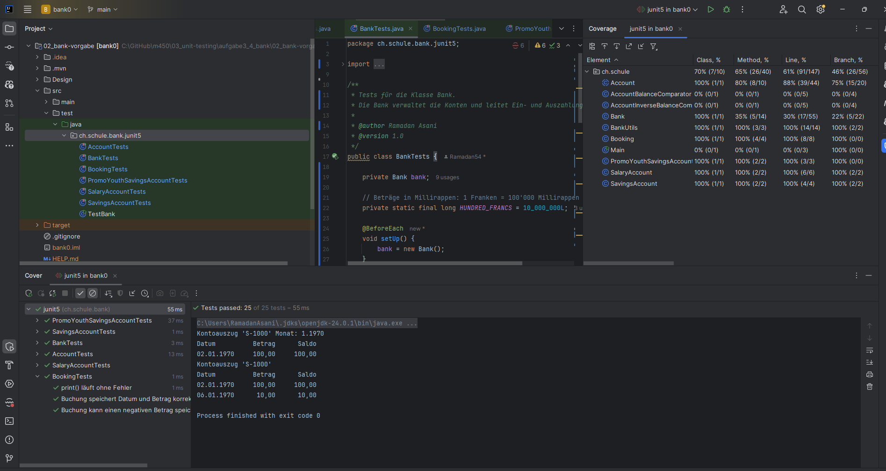

# Modul 450 – Unit Testing

Bearbeitet von: Ramadan Asani

---

## Aufgabe 1 – Simpler Rechner mit JUnit

Es wurde ein Maven-Projekt mit einer `Calculator`-Klasse erstellt, die die vier Grundrechenarten enthält (`add`, `subtract`, `multiply`, `divide`). Für die Division wird der Sonderfall "Division durch null" mit einer Exception abgefangen.

Im Test-Package wurde die Klasse `CalculatorTest` mit JUnit 5 erstellt. Verwendete Annotationen:

- `@Test` – markiert eine Methode als Testfall
- `@BeforeEach` – erstellt vor jedem Test einen neuen Calculator, damit die Tests unabhängig voneinander sind
- `@DisplayName` – gibt jedem Test einen lesbaren Namen im Report

Getestete Fälle: Addition (positiv und negativ), Subtraktion, Multiplikation (inkl. mal null), Division und Division durch null (erwartet eine Exception).

### Ausführung 1 – In der Entwicklungsumgebung (IntelliJ)

Alle 7 Tests wurden in IntelliJ ausgeführt und sind erfolgreich (grün).


### Ausführung 2 – Mit Maven

Die Tests wurden zusätzlich über den Maven-Lifecycle (`test`) ausgeführt. Ergebnis: `Tests run: 7, Failures: 0, Errors: 0` und `BUILD SUCCESS`.


---

## Aufgabe 2 – JUnit Zusammenfassung

JUnit 5 ist das Standard-Framework für Unit-Tests in Java. Hier die gängigsten Features mit kurzen Beispielen.

### Annotationen

**`@Test`** – markiert eine Methode als Testfall.
```java
@Test
void testAddition() {
    assertEquals(4, calculator.add(2, 2));
}
```

**`@BeforeEach`** – wird vor jedem Test ausgeführt. Gut, um für jeden Test frische Objekte zu erstellen, damit die Tests unabhängig bleiben.
```java
@BeforeEach
void setUp() {
    calculator = new Calculator();
}
```

**`@AfterEach`** – wird nach jedem Test ausgeführt, z. B. zum Aufräumen (Dateien schliessen, Verbindungen trennen).

**`@BeforeAll` / `@AfterAll`** – werden einmal vor bzw. nach allen Tests der Klasse ausgeführt. Müssen `static` sein. Nützlich für aufwändiges Setup, das nur einmal nötig ist (z. B. Datenbankverbindung).

**`@DisplayName`** – gibt dem Test einen lesbaren Namen im Report.
```java
@Test
@DisplayName("Addition zweier positiver Zahlen")
void testAdd() { ... }
```

**`@Disabled`** – schaltet einen Test vorübergehend ab (er wird übersprungen).

### Assertions (Prüfungen)

Assertions prüfen, ob das Ergebnis dem Erwarteten entspricht. Schlägt eine fehl, gilt der Test als nicht bestanden.

| Assertion | Zweck |
|-----------|-------|
| `assertEquals(erwartet, ist)` | Prüft auf Gleichheit |
| `assertTrue(bedingung)` / `assertFalse(bedingung)` | Prüft einen booleschen Wert |
| `assertNull(obj)` / `assertNotNull(obj)` | Prüft auf null bzw. nicht null |
| `assertThrows(Exception.class, () -> ...)` | Prüft, ob eine Exception geworfen wird |
| `assertArrayEquals(erwartet, ist)` | Vergleicht zwei Arrays |

Beispiel für `assertThrows`:
```java
@Test
void testDivideByZero() {
    assertThrows(IllegalArgumentException.class, () -> calculator.divide(6, 0));
}
```

### Weitere nützliche Features

**`@ParameterizedTest`** – führt denselben Test mit verschiedenen Eingabewerten aus, statt für jeden Wert eine eigene Methode zu schreiben.
```java
@ParameterizedTest
@ValueSource(ints = {2, 4, 6})
void testIstGerade(int zahl) {
    assertTrue(zahl % 2 == 0);
}
```

**`assertAll`** – prüft mehrere Assertions zusammen und meldet alle Fehler auf einmal, statt beim ersten abzubrechen.

### Referenz

Als Nachschlagewerk eignet sich die offizielle JUnit-5-Dokumentation: https://junit.org/junit5/docs/current/user-guide/

---

## Aufgabe 3 – Banken-Simulation verstehen

Die Banken-Simulation ist ein objektorientiertes Beispiel mit Vererbung. Sie wurde als Maven-Projekt in IntelliJ geöffnet. Nachfolgend die Funktionsweise und die Zusammenhänge in Stichworten.

### Klassen und ihre Aufgaben

- **Account (abstrakt):** Basisklasse für alle Konten. Enthält Kontonummer (`id`), Kontostand (`balance`, in Millirappen) und eine Liste von Buchungen. Bietet `deposit` (einzahlen), `withdraw` (abheben), `canTransact` (prüft, ob das Datum gültig ist) und `print` (Kontoauszug). Weil abstrakt, kann man kein `Account` direkt erstellen – nur die Unterklassen.
- **SavingsAccount (Sparkonto):** Erbt von Account. Überschreibt `withdraw` so, dass nicht mehr abgehoben werden kann, als vorhanden ist (kein negatives Saldo).
- **SalaryAccount (Lohnkonto):** Erbt von Account. Hat eine Kreditlimite (negative Zahl). Beim Abheben darf das Saldo bis zu dieser Limite ins Minus gehen.
- **PromoYouthSavingsAccount (Jugend-Sparkonto):** Erbt von SavingsAccount. Überschreibt `deposit` und gewährt bei jeder Einzahlung 1% Bonus.
- **Bank:** Verwaltet alle Konten in einer `TreeMap` (Kontonummer → Konto). Erstellt Konten (`createSavingsAccount`, `createSalaryAccount`, `createPromoYouthSavingsAccount`), leitet Ein-/Auszahlungen an das richtige Konto weiter und kann die Top-5- bzw. Bottom-5-Konten nach Saldo ausgeben.
- **Booking (Buchung):** Speichert eine einzelne Transaktion mit Datum und Betrag. Jede Ein- oder Auszahlung erzeugt ein Booking.
- **BankUtils:** Hilfsklasse mit statischen Methoden zum Formatieren von Datum (`formatBankDate`) und Beträgen (`formatAmount`).
- **AccountBalanceComparator / AccountInverseBalanceComparator:** Zwei Vergleicher zum Sortieren der Konten nach Kontostand – einmal absteigend, einmal aufsteigend. Werden für die Top-5/Bottom-5-Ausgabe verwendet.

### Zusammenhänge

- **Vererbung:** `Account` ist die Basis. `SavingsAccount` und `SalaryAccount` erben direkt davon, `PromoYouthSavingsAccount` erbt wiederum von `SavingsAccount`. So wird gemeinsames Verhalten (Buchungen, Kontostand) nur einmal in `Account` definiert und pro Kontotyp gezielt angepasst.
- **Verwaltung:** Eine `Bank` besitzt viele `Account`-Objekte. Ein `Account` besitzt viele `Booking`-Objekte (jede Transaktion eine Buchung).
- **Zusammenarbeit:** `Booking` nutzt `BankUtils` zum Formatieren beim Drucken. Die `Bank` nutzt die beiden Comparator-Klassen zum Sortieren.

### Beispielablauf (aus Main)

In `Main` wird eine Bank erstellt, dann ein Jugend-Sparkonto und ein Lohnkonto (mit Kreditlimite 12000) angelegt. Damit ist gezeigt, wie über die Bank verschiedene Kontotypen erzeugt werden.

### Klassendiagramm


---

## Aufgabe 4 – Unit-Tests für die Banken-Simulation

Für die Banken-Simulation wurden mit JUnit 5 Unit-Tests geschrieben. Die vorgegebenen leeren Test-Gerüste (die nur `fail("toDo")` enthielten) wurden mit echten Testfällen gefüllt. Insgesamt sind es 25 Tests über sechs Testklassen.

### Wichtig: Beträge in Millirappen

In dieser Software werden alle Beträge in **Millirappen** gespeichert: 1 Franken = 100'000 Millirappen. 100 Franken sind also `10_000_000`. Das ist im Code an der Methode `formatAmount` erkennbar, die durch 100'000 teilt. In den Tests werden die Beträge deshalb in Millirappen angegeben.

### Verwendete JUnit-Features

- **`@Test`** – markiert eine Methode als Testfall.
- **`@BeforeEach`** – wird vor jedem einzelnen Test ausgeführt und erstellt ein frisches Objekt. So sind die Tests unabhängig voneinander (ein Merkmal guter Unit-Tests).
- **`@DisplayName`** – gibt jedem Test einen lesbaren Namen im Report.
- **Assertions:** `assertEquals` (Wert prüfen), `assertTrue` / `assertFalse` (boolescher Rückgabewert), `assertNull` / `assertNotNull` (Objekt vorhanden?), `assertDoesNotThrow` (Methode läuft ohne Fehler – für `void`-Methoden wie `print()`, die keinen Rückgabewert haben).

### Getestete Klassen und Besonderheiten

- **AccountTests (8 Tests):** Da `Account` abstrakt ist, wird über die Unterklasse `SavingsAccount` getestet. Geprüft werden Initialisierung, Ein- und Auszahlen, Ablehnung negativer Beträge, die Vererbungs-Referenz, das `canTransact`-Flag (verhindert Transaktionen mit einem Datum vor der letzten Buchung) und die beiden `print`-Methoden.
- **SavingsAccountTests (3 Tests):** Das Sparkonto darf nicht ins Minus. Getestet werden normales Abheben, Ablehnung bei zu hoher Abhebung und der Grenzfall, bei dem genau das ganze Guthaben abgehoben wird (Grenzwertanalyse).
- **SalaryAccountTests (3 Tests):** Das Lohnkonto darf bis zur Kreditlimite (negative Zahl) ins Minus. Getestet werden Abheben im Guthaben, Abheben bis in den erlaubten Minusbereich und Ablehnung über die Limite hinaus.
- **PromoYouthSavingsAccountTests (3 Tests):** Das Jugend-Sparkonto gewährt bei jeder Einzahlung 1% Bonus. Bei 100 Franken Einzahlung ergibt das 101 Franken. Zusätzlich gilt weiterhin die Sparkonto-Sperre gegen Überziehen.
- **BookingTests (3 Tests):** Eine Buchung speichert Datum und Betrag. Getestet werden korrekte Speicherung, negative Beträge (Abhebungen werden als negative Buchung abgelegt) und die `print`-Methode.
- **BankTests (5 Tests):** Die Bank verwaltet die Konten. Getestet werden Kontoerstellung, Ablehnung eines Lohnkontos mit ungültiger (positiver) Kreditlimite, Einzahlen über die Bank und die Fehlerfälle bei unbekannten Konten.

### Ergebnis: Alle Tests grün und Code Coverage

Alle 25 Tests laufen erfolgreich durch. Die Code Coverage wurde über "Run with Coverage" gemessen.



Die Coverage-Werte im Überblick: Die gesamte fachliche Kernlogik ist zu 100% abgedeckt – Account (Zeilen 88%), SavingsAccount, SalaryAccount, PromoYouthSavingsAccount, Booking und BankUtils jeweils 100%. Nicht vollständig abgedeckt sind bewusst:

- **Main (0%):** nur die Startklasse, enthält keine fachliche Logik.
- **AccountBalanceComparator / AccountInverseBalanceComparator (0%):** reine Hilfsklassen zum Sortieren.
- **Bank (35%):** die zentralen Methoden (Konto erstellen, ein-/auszahlen) sind getestet; Ausgabe-Methoden wie `printTop5` / `printBottom5` wurden nicht getestet.

Das entspricht dem Grundsatz aus dem Lerninhalt: Unit-Tests sollen den relevanten Code testen und nicht triviale Teile wie die Startklasse oder reine Ausgabe-Methoden.