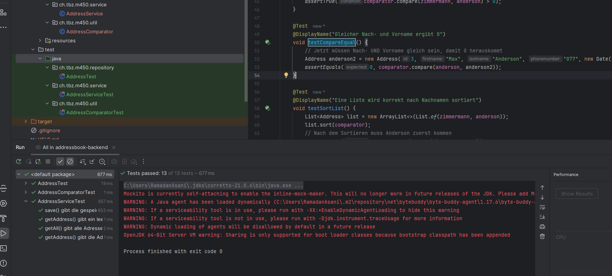

# Modul 450 – Schnittstellen (Mocking mit Test Doubles)

Bearbeitet von: Ramadan Asani

In diesem Block wird das Addressbook-Backend getestet, ein Spring-Boot-Projekt mit einer H2-Datenbank. Das Kernthema ist das Testen von Klassen, die Abhängigkeiten zu anderen Systemen haben (hier: die Datenbank), mit Hilfe von Test Doubles und dem Framework Mockito.

## Theorie: Test Doubles

Wenn man eine Methode testen will, die von anderen Klassen abhängt (z. B. von einer Datenbank), will man diese Abhängigkeit im Test oft nicht wirklich mitlaufen lassen. Man ersetzt sie durch ein Test Double – ein Ersatzobjekt, das im Test die Rolle der echten Abhängigkeit übernimmt (vergleichbar mit einem Stunt-Double im Film).

Es gibt zwei Hauptkategorien:

- **Stub** (State testing): Ein Objekt mit fest vordefinierten Daten, das auf Aufrufe antwortet. Man prüft danach den Zustand des Ergebnisses. Ein Stub gibt Daten an die zu testende Klasse und beeinflusst das Testergebnis nicht durch eigene Prüfungen.
- **Mock** (Behavioral testing): Ein Objekt, dem man vorher sagt, welche Aufrufe es erwartet. Nach dem Test prüft man, ob die richtigen Methoden aufgerufen wurden. Ein Mock prüft also das Zusammenspiel (die Interaktion) zwischen der getesteten Klasse und ihrer Abhängigkeit.

Die einzelnen Arten von Test Doubles:

- **Dummy:** Ein sehr einfaches Platzhalter-Objekt, das nur übergeben wird, um z. B. einen Konstruktor zu füllen (oft einfach `null`). Es hat keine echte Funktion.
- **Stub:** Enthält vordefinierte, meist hartcodierte Daten und liefert diese auf Anfrage zurück. Nützlich, wenn man keine echten Objekte (z. B. aus der Datenbank) verwenden will.
- **Fake:** Hat eine funktionierende, aber vereinfachte Implementierung (z. B. eine In-Memory-Datenbank statt einer echten DB). Näher an der Realität als ein Stub.
- **Mock:** Ein Objekt, dem man Erwartungen setzt und das prüft, ob es korrekt aufgerufen wurde.
- **Spy:** Zeichnet auf, wie es aufgerufen wurde. Anders als ein Mock schweigt er zunächst; man wertet die aufgezeichneten Daten selbst mit Asserts aus.

Für die praktische Umsetzung wird **Mockito** verwendet – ein Framework, das mit Dummies, Stubs, Mocks und Spies umgehen kann.

## Aufgabe 1 – Tests schreiben und Datenbank mocken

### Address-Tests

Zuerst wurde die Klasse `Address` getestet. Sie nutzt Lombok (`@Getter`, `@Setter`, `@AllArgsConstructor`, `@NoArgsConstructor`), das Getter, Setter und Konstruktoren automatisch erzeugt. Getestet werden die Werte nach dem Erstellen, die Setter und der leere Konstruktor.

### Service-Test mit weggemockter Datenbank

Der `AddressService` hängt vom `AddressRepository` ab, das mit der H2-Datenbank redet. Um den Service isoliert zu testen, wird das Repository mit Mockito weggemockt – es läuft also keine echte Datenbank.

Verwendete Mockito-Bausteine:

- `@ExtendWith(MockitoExtension.class)` – aktiviert Mockito für die Testklasse.
- `@Mock` – erzeugt ein gefälschtes `AddressRepository` (die weggemockte Datenbank).
- `@InjectMocks` – setzt den Mock automatisch in den `AddressService` ein.
- `when(...).thenReturn(...)` – legt fest, was der Mock zurückgibt, wenn eine Methode aufgerufen wird (Stub-Verhalten).
- `verify(...)` – prüft, ob der Service die Repository-Methode wirklich aufgerufen hat (Mock-Verhalten).

Getestet werden `save`, `getAll` und `getAddress` (Adresse gefunden und nicht gefunden). Der grosse Vorteil: Die Tests sind schnell, unabhängig und brauchen keine laufende Datenbank.

### Comparator korrekt implementieren

Der mitgelieferte `AddressComparator` war absichtlich fehlerhaft (`return -1`, also keine echte Sortierung). Er wurde korrekt implementiert: Er vergleicht die Adressen nach dem Nachnamen mit `compareTo`. Dazu wurden Tests geschrieben, die prüfen, dass früher/später im Alphabet und gleiche Namen korrekt behandelt werden und dass eine Liste richtig sortiert wird.

## Aufgabe 2 – Comparator erweitern

Der Comparator wurde erweitert, sodass nach mehreren Attributen sortiert wird: zuerst nach Nachnamen, bei gleichem Nachnamen zusätzlich nach Vornamen. Ist der Nachnamen-Vergleich 0, wird als zweites Kriterium der Vorname verglichen.

Für die neue Funktionalität wurden zusätzliche Tests geschrieben (Sortierung nach Vorname bei gleichem Nachnamen). Ein bestehender Test musste angepasst werden: Vorher galt „gleicher Nachname ergibt 0", jetzt müssen Nach- und Vorname gleich sein. Das zeigt gut, dass Tests eine Verhaltensänderung sofort aufdecken.

## Ergebnis

Alle 13 Tests der drei Testklassen (AddressTest, AddressServiceTest, AddressComparatorTest) laufen erfolgreich durch.

