# Modul 450 – Automation Testing

Bearbeitet von: Ramadan Asani

---

## Einführung

In diesem Block geht es um automatisiertes Testen. Anders als beim manuellen Testen werden die Testfälle nicht von Hand durchgeklickt, sondern als Skript hinterlegt und per Knopfdruck (bzw. per Terminal-Befehl) ausgeführt. Der grosse Vorteil: Die Tests laufen jederzeit gleich ab, sind wiederholbar und lassen sich z. B. in eine CI/CD-Pipeline einbinden.

Als Testobjekt dient die vorgegebene **Studenten-Applikation** – ein Spring-Boot-Backend mit einer Angular-Oberfläche:

- **Backend (Spring Boot):** läuft auf Port `8081`, nutzt eine H2-Datenbank und bietet zwei REST-Endpunkte: `GET /students` (alle Studenten abrufen) und `POST /students` (einen Studenten anlegen). Beim Start werden fünf Studenten vorangelegt (Jonas, Patrick, Yves, Peter, Ann).
- **Frontend (Angular):** läuft auf Port `4200`, zeigt eine Liste der Studenten und ein Formular zum Anlegen.

Für die drei Übungen wurden drei verschiedene Werkzeuge eingesetzt, jeweils passend zum Testziel:

| Übung | Testziel | Werkzeug |
| ----- | -------- | -------- |
| 1 | REST-Schnittstelle des Backends | Postman + Newman |
| 2 | Angular-Oberfläche (End-to-End) | Cypress |
| 3 | Lasttest des Backends | Apache JMeter |

---

## Setup – Backend und Frontend zum Laufen bringen

### Backend

Die App wurde in IntelliJ als Maven-Projekt geöffnet. Beim ersten Start wurde ein Java-Problem sichtbar: Das Projekt ist auf **Java 17** eingestellt, und die enthaltene Lombok-Version (aus Spring Boot 3.1.2) unterstützt nur Java bis Version 20. Mit einem neueren JDK bricht der Compiler mit `TypeTag :: UNKNOWN` ab. Lösung: In der Projektstruktur das SDK auf **JDK 17** gestellt, danach lässt sich das Projekt sauber bauen.

Nach dem Start meldet die Konsole `Tomcat started on port(s): 8081` und `Started StudentApplication`. Die fünf vorangelegten Studenten werden ebenfalls geloggt.

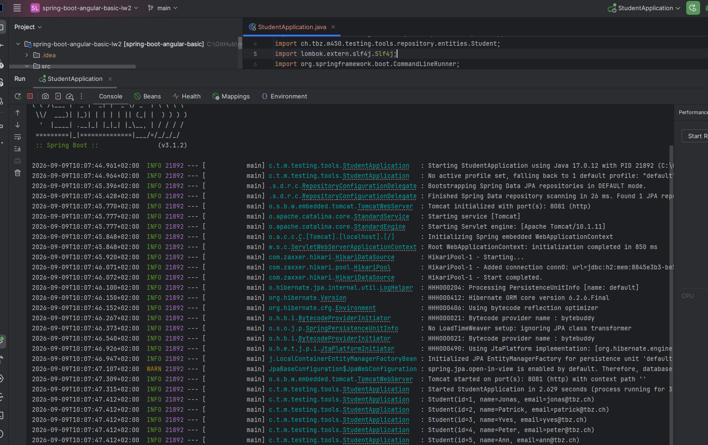

Zur Gegenprobe wurde die REST-Schnittstelle direkt im Browser aufgerufen (`http://localhost:8081/students`). Sie liefert die fünf Studenten als JSON zurück.

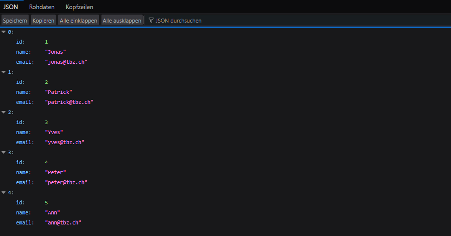

### Frontend

Das Angular-Frontend liegt im Projekt unter `src/main/js/my-app`. Nach `npm install` (Abhängigkeiten laden) wurde es mit `npm start` gestartet. Die Konsole meldet `Compiled successfully` und dass der Entwicklungsserver auf `http://localhost:4200` lauscht.

Die App zeigt eine Studenten-Liste (Spalten #, Name, Email) und ein Formular zum Anlegen neuer Studenten. Backend (8081) und Frontend (4200) laufen für die Tests gleichzeitig.

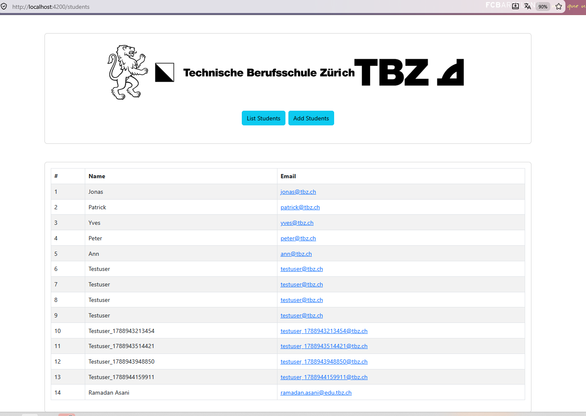

---

## Übung 1 – REST-Schnittstelle automatisiert testen (Postman + Newman)

Ziel war es, die REST-Schnittstelle des Backends automatisiert zu testen. Dafür wurde in **Postman** eine Collection `M450 Student API` mit zwei Requests aufgebaut und mit automatischen Tests versehen. Der eigentliche Automatisierungs-Nachweis erfolgt am Schluss mit **Newman**, dem Kommandozeilen-Werkzeug von Postman, das die Collection ohne grafische Oberfläche durchläuft.

### Request 1 – GET alle Studenten

Der erste Request ruft `GET http://localhost:8081/students` auf. Im Reiter "Scripts / Post-response" wurden fünf automatische Tests hinterlegt:

- Status ist 200 OK
- Antwort ist JSON
- Es sind mindestens 5 Studenten vorhanden
- Die fünf Standard-Studenten (Jonas, Patrick, Yves, Peter, Ann) sind alle enthalten
- Jeder Student hat die Felder id, name und email

Wichtig war, die Tests **wiederholbar** zu machen. Zuerst wurde auf "genau 5 Studenten" geprüft – das schlug fehl, sobald über den POST-Request weitere Studenten angelegt wurden. Deshalb wird stattdessen auf "mindestens 5" geprüft und ob die erwarteten Namen enthalten sind. So läuft der Test unabhängig davon, wie viele Studenten schon in der Datenbank stehen, immer grün durch.

`pm.test(...)` ist dabei ein einzelner Testfall, `pm.expect(...)` die Assertion – dasselbe Prinzip wie `assertEquals` bei JUnit, nur für die REST-Antwort.

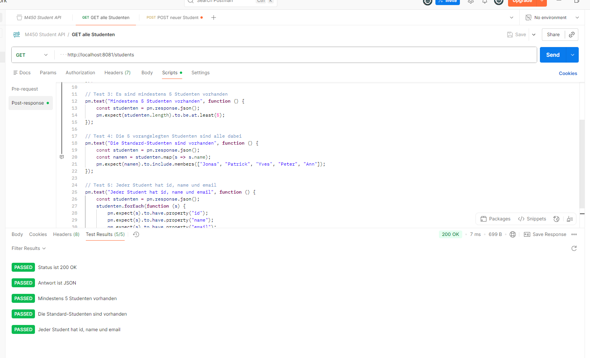

### Request 2 – POST neuer Student

Der zweite Request legt über `POST http://localhost:8081/students` einen neuen Studenten an. Damit jeder Testlauf sauber und wiederholbar ist, erzeugt ein Pre-request-Script bei jedem Lauf einen eindeutigen Namen (mit Zeitstempel):

```javascript
const eindeutig = "Testuser_" + Date.now();
pm.collectionVariables.set("neuerName", eindeutig);
pm.collectionVariables.set("neueMail", eindeutig.toLowerCase() + "@tbz.ch");
```

Der Body verwendet diese Variablen (`{{neuerName}}`, `{{neueMail}}`). Die Tests prüfen zwei Dinge:

- POST war erfolgreich (Status 200)
- Der neu angelegte Student ist danach wirklich in der Liste vorhanden

Der zweite Test schickt im Post-response-Script selbst noch einmal ein GET los und prüft, dass der gerade angelegte Name in der Liste auftaucht – ein kleiner Integrationstest über zwei Requests hinweg. Die Response des POST selbst ist leer, weil die Methode `addStudent` im Backend `void` ist (kein Rückgabewert).

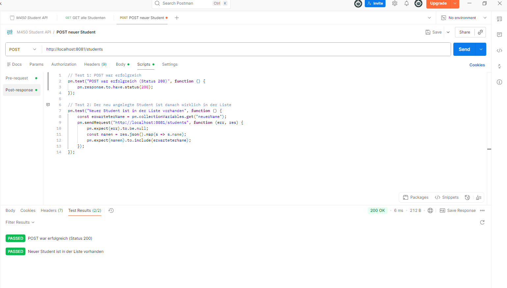

### Ganze Collection auf einen Schlag (Collection Runner)

Mit dem Collection Runner werden beide Requests automatisch nacheinander ausgeführt. Ergebnis: **7 passed, 0 failed** (5 Assertions aus GET, 2 aus POST).

Hier zeigte sich ein wichtiger Punkt zu Postman: Der Runner nutzt nur die **gespeicherte** Version der Requests. Solange am Tab noch der grüne Punkt (= ungespeichert) war, lief der POST ins Leere ("Empty request URL"). Nach dem Speichern lief alles grün durch.

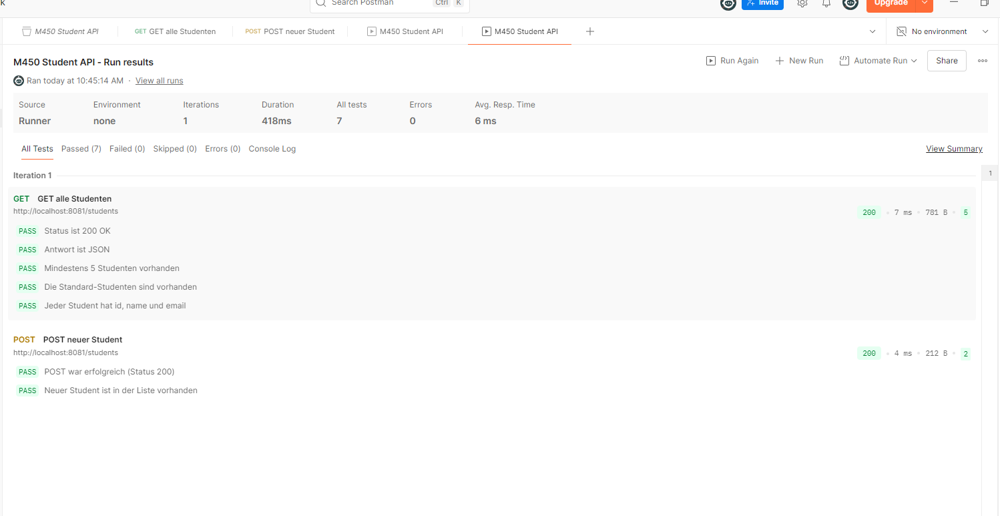

### Automatisierung mit Newman (Terminal)

Der eigentliche Automatisierungs-Nachweis: Die Collection wurde aus Postman als JSON exportiert und mit **Newman** direkt im Terminal ausgeführt – ohne grafische Oberfläche, mit einem einzigen Befehl:

```powershell
newman run "M450 Student API.postman_collection.json"
```

Newman spielt beide Requests ab und zeigt am Ende eine Zusammenfassung: **7 assertions executed, 0 failed**.

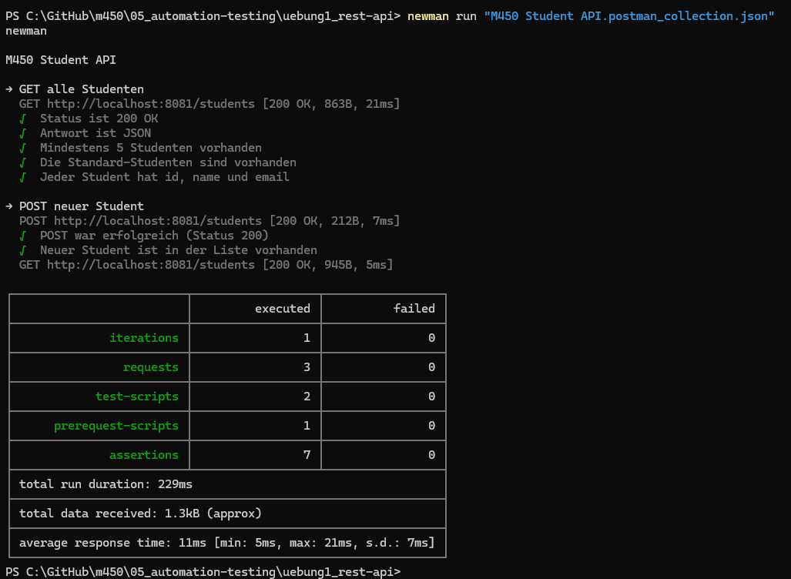

Zusätzlich wurde ein HTML-Report erzeugt (mit dem Reporter `htmlextra`):

```powershell
newman run "M450 Student API.postman_collection.json" -r htmlextra --reporter-htmlextra-export report.html
```

Der Report zeigt als Dashboard übersichtlich: 1 Iteration, 7 Assertions, 0 Failed Tests, 0 Skipped Tests.

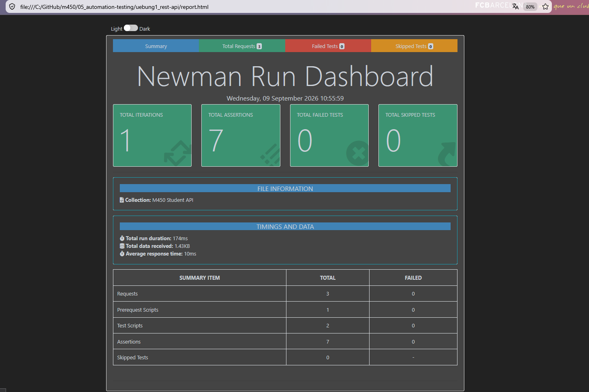

**Fazit Übung 1:** Die REST-Schnittstelle ist vollständig automatisiert getestet. Der Unterschied zum manuellen Klicken in Postman: Mit Newman läuft alles per Terminal-Befehl, ohne Oberfläche – genau so, wie es in einer CI/CD-Pipeline laufen würde.

---

## Übung 2 – Frontend automatisiert testen (Cypress, End-to-End)

Ziel war ein automatisierter End-to-End-Test der Angular-Oberfläche, der im Browser abläuft. Dafür wurde **Cypress** ins Angular-Projekt installiert (`npm install cypress --save-dev`).

In der `cypress.config.ts` wurde die Basis-URL hinterlegt, damit im Test nur noch relative Pfade nötig sind:

```typescript
export default defineConfig({
  e2e: {
    baseUrl: "http://localhost:4200",
    setupNodeEvents(on, config) {
    },
  },
});
```

### Der Testfall

Die Tests wurden selbst geschrieben (Datei `cypress/e2e/student.cy.ts`) und decken drei Fälle ab:

1. **Startseite:** Die beiden Buttons "List Students" und "Add Students" sind sichtbar.
2. **Liste:** Nach Klick auf "List Students" sind die fünf Standard-Studenten (Jonas, Patrick, Yves, Peter, Ann) in der Tabelle.
3. **Student anlegen (der eigentliche E2E-Flow):** Auf "Add Students" klicken, Name und E-Mail ins Formular eintippen, "Submit" klicken – und danach auf der Liste prüfen, dass der neu angelegte Student wirklich erscheint.

Um die passenden Selektoren zu finden, wurde das Formular im Code angeschaut: Die Eingabefelder haben die IDs `name` und `email`, der Absende-Button heisst "Submit". Nach dem Absenden leitet die App automatisch auf die Liste (`/students`) um.

Wie schon bei Newman wird auch hier der Name pro Lauf eindeutig gemacht (mit Zeitstempel), damit der Test beliebig oft wiederholbar bleibt:

```typescript
const eindeutigerName = 'CypressTest_' + Date.now();
```

Die wichtigsten Cypress-Befehle:

- `describe(...)` = Gruppe von Tests, `it(...)` = einzelner Testfall
- `cy.visit('/')` = Seite öffnen (dank baseUrl reicht das `/`)
- `cy.contains('Text').click()` = Element mit Text finden und klicken
- `cy.get('#name').type(...)` = Feld über die ID holen und Text eintippen
- `.should('be.visible')` = die Assertion (Element muss sichtbar sein)

### Ausführung in der Cypress-Oberfläche

In der Cypress-Oberfläche laufen alle drei Tests grün durch. Rechts sieht man dabei live, wie die App gesteuert wird (Klicken, Tippen, Umleiten).

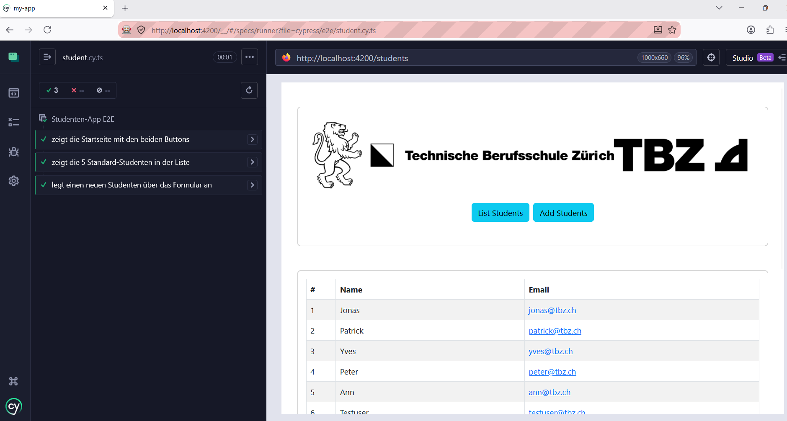

### Automatisierung im Terminal (headless)

Analog zu Newman lässt sich der Test auch ohne sichtbares Fenster direkt im Terminal ausführen (headless-Modus):

```powershell
npx cypress run --browser firefox
```

Ergebnis: **3 passing**, Tests: 3, Passing: 3, Failing: 0, und am Schluss `All specs passed!`.

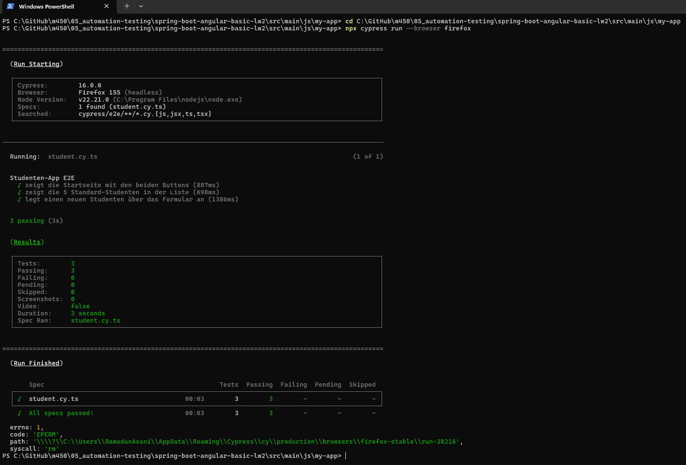

Die roten Zeilen ganz unten (`EPERM`, `rm`) sind ein bekannter Aufräum-Effekt von Cypress unter Windows (ein temporärer Browser-Profilordner konnte nicht gelöscht werden). Sie treten erst **nach** dem Testlauf auf und haben keinen Einfluss auf das Ergebnis – die Tests sind alle erfolgreich (`All specs passed!`).

**Fazit Übung 2:** Der komplette Ablauf "Formular ausfüllen → Absenden → Ergebnis prüfen" läuft automatisiert im echten Browser ab, per einem Terminal-Befehl. Das ist ein echter End-to-End-Test über Frontend und Backend hinweg.

---

## Übung 3 – Lasttest mit JMeter

Ziel war es, das Backend mit grösserem Traffic zu belasten und das Verhalten unter Last zu messen. Dafür wurde **Apache JMeter** verwendet.

### Aufbau des Testplans

Der Testplan folgt dem üblichen JMeter-Aufbau: **Test Plan → Thread Group → HTTP Request → Listeners**.

- **Thread Group (virtuelle Benutzer):**
  - Number of Threads (users): **50** – 50 parallele Benutzer
  - Ramp-up period: **5** Sekunden – die Benutzer werden über 5 Sekunden verteilt gestartet (realistischer als ein schlagartiger Start)
  - Loop Count: **10** – jeder Benutzer schickt seine Anfrage 10-mal

  Das ergibt insgesamt **50 × 10 = 500 Anfragen**.

- **HTTP Request:** `GET` auf `localhost`, Port `8081`, Pfad `/students` – also dieselbe Anfrage wie in Übung 1, nur eben 500-mal von 50 parallelen Benutzern.

- **Listeners (Auswertung):** Summary Report, Aggregate Report und View Results Tree.

Der Testplan wurde als `student-lasttest.jmx` gespeichert.

### Ergebnisse

Der **Aggregate Report** zeigt die Auswertung mit Perzentilen:

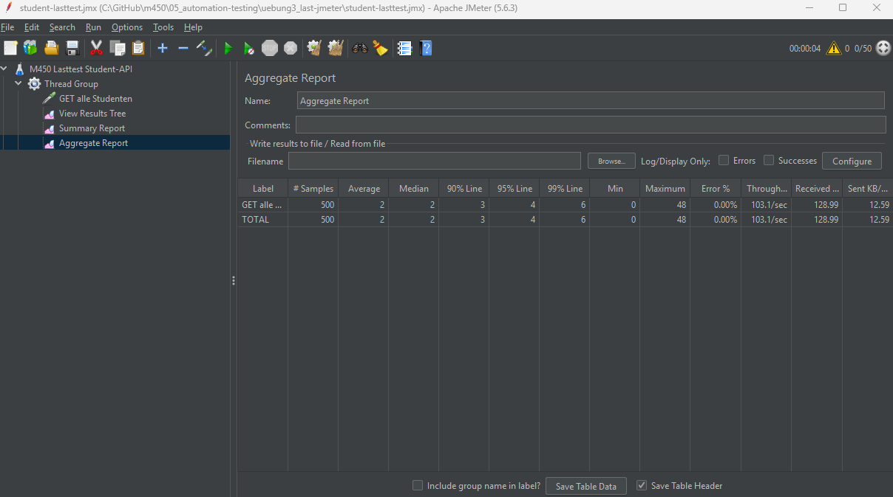

Die wichtigsten Werte:

| Kennzahl | Wert | Bedeutung |
| -------- | ---- | --------- |
| # Samples | 500 | alle 500 Anfragen ausgeführt |
| Average | 2 ms | durchschnittliche Antwortzeit |
| Median | 2 ms | die Hälfte der Anfragen ≤ 2 ms |
| 90 % / 95 % / 99 % Line | 3 / 4 / 6 ms | auch die langsamsten 1 % unter 6 ms |
| Min / Max | 0 / 48 ms | die erste Anfrage (Backend "aufwärmen") war am langsamsten |
| Error % | 0.00 % | keine einzige Anfrage fehlgeschlagen |
| Throughput | 103.1/sec | rund 103 Anfragen pro Sekunde |

Der **Summary Report** bestätigt dieselben Zahlen in kompakterer Form (500 Samples, Average 2 ms, Max 48 ms, Error 0.00 %, Throughput 103.1/sec).

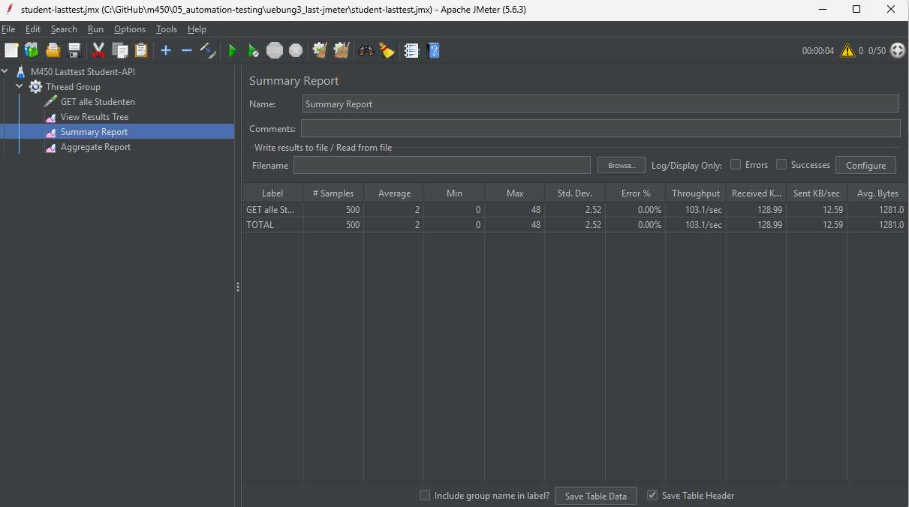

Der **View Results Tree** zeigt jede einzelne Anfrage. Alle 500 Einträge sind grün – kein einziger Fehler. Das ist der visuelle Beweis, dass das Backend die Last vollständig fehlerfrei bewältigt hat.

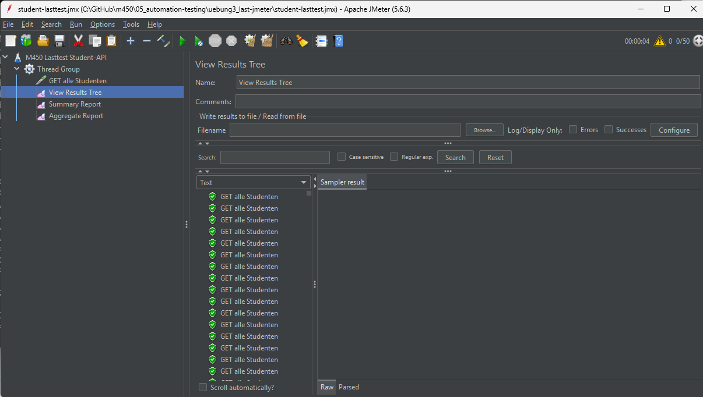

### Bemerkung zum GUI-Modus

JMeter blendet beim Start den Hinweis ein, dass für echte Lasttests der GUI-Modus nicht verwendet werden soll, sondern der Kommandozeilen-Modus. Für dieses Übungsszenario (überschaubare Last, zum Lernen und Zeigen) ist der GUI-Modus in Ordnung. Bei einem echten, grossen Lasttest würde man JMeter ohne GUI im Non-GUI-Modus laufen lassen, weil die grafische Oberfläche selbst Ressourcen braucht und die Messwerte verfälschen könnte.

**Fazit Übung 3:** Das Backend hält 50 gleichzeitige Benutzer mit insgesamt 500 Anfragen problemlos aus – schnell (Durchschnitt 2 ms) und komplett fehlerfrei (0 % Error, ~103 Anfragen/Sekunde).

---

## Gesamtfazit

In diesem Block wurden drei verschiedene Arten von automatisiertem Testen praktisch umgesetzt:

- **Übung 1** – funktionaler API-Test mit Postman/Newman (prüft, ob die Schnittstelle das Richtige zurückgibt).
- **Übung 2** – End-to-End-Test des Frontends mit Cypress (prüft die Anwendung aus Benutzersicht im Browser).
- **Übung 3** – nicht-funktionaler Lasttest mit JMeter (prüft, wie sich das Backend unter Last verhält).

Bei allen drei Übungen war ein zentraler Punkt, die Tests **wiederholbar** zu gestalten (z. B. eindeutige Namen mit Zeitstempel), damit sie unabhängig vom aktuellen Datenbankzustand immer gleich durchlaufen. Genau das macht automatisierte Tests wertvoll: Sie lassen sich jederzeit und beliebig oft per Knopfdruck bzw. Terminal-Befehl ausführen.
