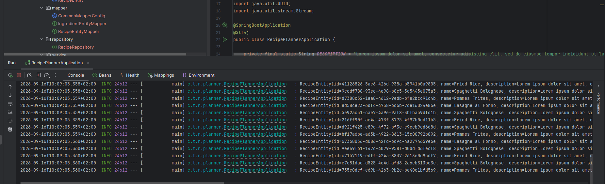
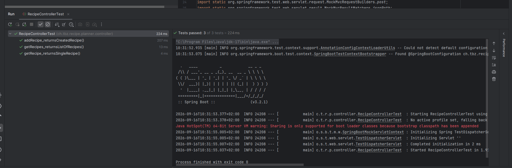
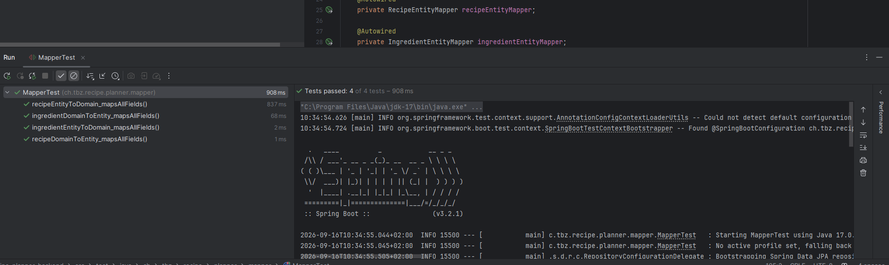
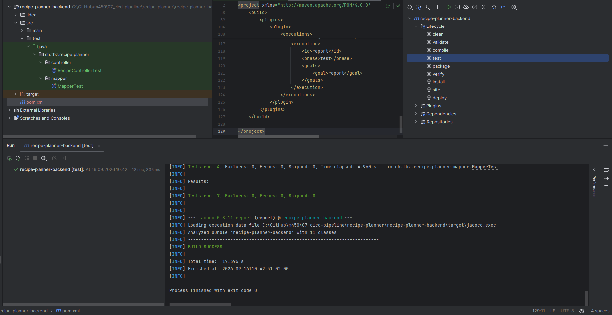
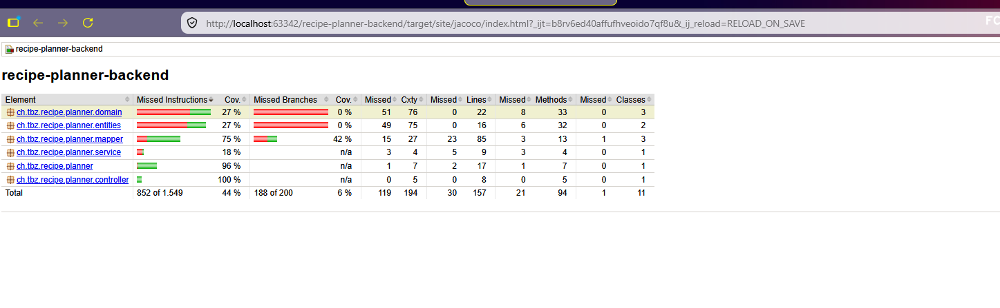
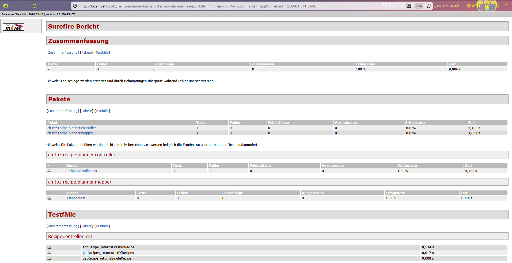
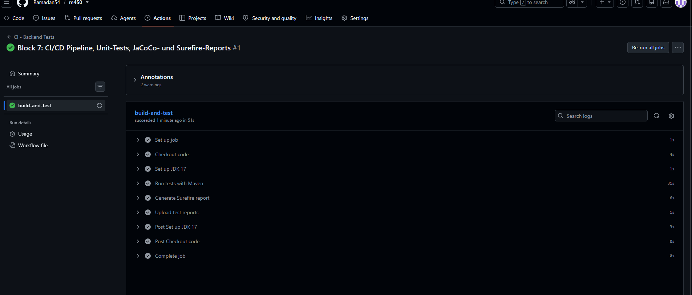
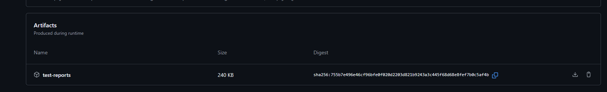
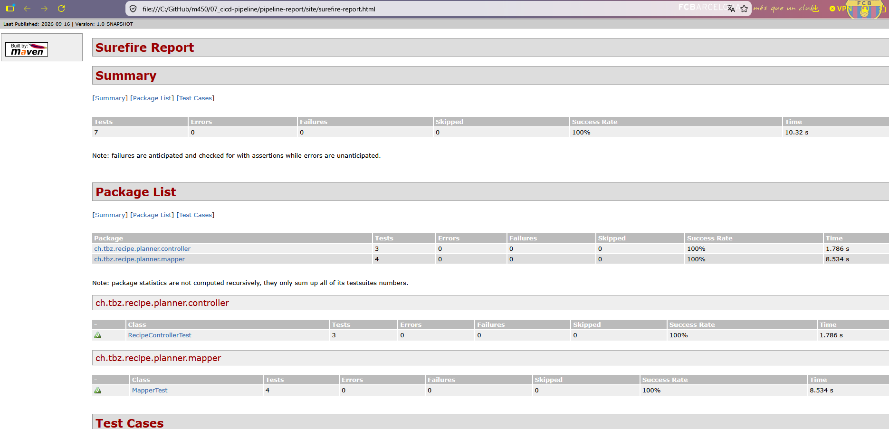

# Block 7 – CI/CD Pipelines und Deployment-Umgebung

## Einleitung

In diesem Block habe ich gelernt, wie man eine Applikation automatisch testet und über eine Pipeline
baut. Als Testobjekt diente das vorgegebene Projekt **Recipe-Planner** (ein Spring-Boot-Backend mit
einer H2-Datenbank und ein React-Frontend). Für die Aufgaben war nur das Backend wichtig, das
Frontend habe ich nur zum Verständnis in Betrieb genommen.

Der Block hat drei Aufgaben:

1. **Unit Testing** – die Controller-Methoden und die Mapper-Klassen testen
2. **Reports** – automatische Test-Reports erzeugen (JaCoCo und Surefire)
3. **Pipeline** – eine CI/CD-Pipeline aufsetzen, die bei jedem Push die Tests laufen lässt

Zuerst habe ich das Backend in IntelliJ gestartet, um zu prüfen, dass alles läuft. Im Log erscheint
`Started RecipePlannerApplication` und die Beispiel-Rezepte werden in die H2-Datenbank geladen.

---

## Theorie – Deployment-Environments

Bevor eine Software zu den Benutzern kommt, durchläuft sie meistens mehrere Umgebungen. Jede
Umgebung hat eine eigene Aufgabe:

- **Development (Dev):** Die Umgebung des Entwicklers (die eigene Workstation). Hier wird der Code
  geschrieben und zuerst getestet.
- **Testing:** Hier wird der neue Code gezielt getestet, automatisch oder von Testern. Schlägt ein
  Test fehl, geht der Code zurück zum Entwickler.
- **Staging:** Eine Kopie der Produktionsumgebung, so ähnlich wie möglich zum echten System. Hier
  werden Installations- und Konfigurationsschritte sowie Lasttests geprüft, bevor es live geht.
- **Production (Live):** Die echte Umgebung, mit der die Benutzer direkt arbeiten. Hier ist ein
  Deployment am heikelsten.

Die Reihenfolge ist also: **Development → Testing → Staging → Production**.

### Patch, Update und Upgrade

- **Patch:** Eine kleine, schnelle Korrektur, die ein oder mehrere Probleme behebt. Betrifft meist
  nur einen Teil des Systems.
- **Update:** Bringt die Software auf den neuesten Stand (Fehler beheben, Performance verbessern,
  kleine Erweiterungen). Verändert den Funktionsumfang aber nicht grundlegend.
- **Upgrade:** Eine grössere Erweiterung, die neue Funktionen oder sogar eine neue Struktur bringt.
  Das Produkt kommt in eine neue "Klasse".

---

## Aufgabe 1 – Unit Testing

Ziel: Die Controller-Methoden und die Mapper-Klassen testen. Der `src/test`-Ordner war am Anfang
leer, ich habe die Tests selber geschrieben.

### Teil 1 – Controller mit MockMvc

Der `RecipeController` hat drei Methoden (Rezepte auflisten, ein Rezept holen, ein Rezept anlegen).
Ich habe diese mit **MockMvc** getestet. MockMvc simuliert HTTP-Requests, ohne dass ein echter
Server laufen muss. Den `RecipeService` habe ich dabei mit `@MockBean` gemockt, damit nur der
Controller isoliert getestet wird – der Test prüft also nur, ob bei einem Request der richtige
Statuscode und das richtige JSON zurückkommen.

Wichtig war ein zusätzlicher Mock für das `RecipeRepository`. Der Grund: Die Hauptklasse
`RecipePlannerApplication` lädt beim Start Beispieldaten und braucht dafür das Repository. Ohne
diesen Mock startet der Test-Kontext nicht.

Ich habe drei Tests geschrieben (einen pro Controller-Methode). Alle drei laufen grün durch.

### Teil 2 – Mapper mit SoftAssertions

Die Mapper wandeln zwischen **Entity** (Datenbank-Objekt) und **Domain** (Business-Objekt) hin und
her. Ich habe für beide Domänen-Klassen (`Recipe` und `Ingredient`) getestet, dass beim Umwandeln
jedes Feld korrekt übernommen wird – und zwar in beide Richtungen.

Dafür habe ich **SoftAssertions** (aus AssertJ) verwendet. Der Vorteil: Normale Assertions stoppen
beim ersten Fehler. SoftAssertions prüfen dagegen **alle** Felder durch und melden am Schluss mit
`assertAll()` **alle** Fehler auf einmal. So sieht man in einem Durchlauf, welche Felder nicht
stimmen, statt jeden Fehler einzeln zu suchen.

Insgesamt sind das vier Tests (Ingredient hin und zurück, Recipe hin und zurück). Alle vier sind
grün.

Damit sind es zusammen **7 Tests**: 3 für den Controller, 4 für die Mapper.

---

## Aufgabe 2 – Reports

Ziel: Nach jedem Testlauf sollen automatisch sichtbare Reports entstehen. Ich habe zwei Arten
eingebaut, weil sie unterschiedliche Dinge zeigen:

- **JaCoCo** → zeigt die **Code Coverage** (wie viel Prozent des Codes von den Tests abgedeckt ist).
- **Surefire** → zeigt die **Testergebnisse** (welche Tests gelaufen und bestanden sind).

Beide habe ich als Maven-Plugin in die `pom.xml` eingebaut. Danach habe ich die Tests über Maven
ausgeführt (`clean` und `test`). Alle 7 Tests laufen durch und JaCoCo erzeugt automatisch den
Report. Am Ende steht `BUILD SUCCESS`.

### JaCoCo-Report (Coverage)

Der Coverage-Report liegt unter `target/site/jacoco/index.html` und lässt sich im Browser öffnen.
Man sieht eine Tabelle mit allen Packages und farbigen Balken (grün = getestet, rot = nicht
getestet). Die Packages `controller` (100 %) und `mapper` (75 %) sind gut abgedeckt, weil ich sie
gezielt getestet habe. `service`, `domain` und `entities` sind weniger abgedeckt – das ist normal
und zeigt ehrlich, wo noch Tests fehlen würden.

### Surefire-Report (Testergebnisse)

Zusätzlich habe ich mit dem Surefire-Report-Plugin einen HTML-Report der Testergebnisse erzeugt.
Er zeigt eine Zusammenfassung: **7 Tests, 0 Fehler, 0 Fehlschläge, Erfolgsrate 100 %**, aufgeteilt
nach den Testklassen `RecipeControllerTest` und `MapperTest`.

---

## Aufgabe 3 – CI/CD-Pipeline

Ziel: Ein Push ins Repository soll automatisch die Pipeline starten, die die Unit-Tests ausführt.
Pro Durchlauf soll ein Report einsehbar sein.

Mein Repository liegt auf **GitHub**, darum habe ich die Pipeline mit **GitHub Actions** gebaut. Das
Prinzip ist gleich wie in der Theorie (Stages und Jobs, Tests laufen bei jedem Push), nur heisst die
Datei bei GitHub `.github/workflows/ci.yml` statt `.gitlab-ci.yml`.

Die Pipeline macht bei jedem Push auf `main` folgendes:

1. Sie holt den Code aus dem Repository (Checkout).
2. Sie installiert **JDK 17** (gleich wie lokal).
3. Sie führt `mvn clean test` aus (dabei laufen die 7 Tests und JaCoCo erzeugt seinen Report).
4. Sie erzeugt den Surefire-Report.
5. Sie lädt beide Reports als herunterladbares **Artifact** hoch.

Weil mein Repo verschachtelt ist (das Backend liegt in einem Unterordner), habe ich im Workflow ein
`working-directory` gesetzt, damit Maven im richtigen Ordner läuft. Beim Upload-Schritt habe ich
`if: always()` gesetzt – so wird der Report auch dann hochgeladen, wenn ein Test fehlschlägt (genau
dann will man ihn ja sehen).

Nach dem Push ist die Pipeline auf GitHub im Tab **Actions** direkt angelaufen und beim ersten
Versuch komplett grün durchgelaufen. Alle Schritte haben ein grünes Häkchen.

### Report pro Durchlauf einsehbar

Die Anforderung "ein Report pro Pipeline-Durchlauf" ist über die **Artifacts** erfüllt. Auf der
Summary-Seite des Laufs erscheint unten das Artifact `test-reports`, das man herunterladen kann.

Ich habe das Artifact heruntergeladen und lokal in meinen Block gelegt (Ordner `pipeline-report`).
So kann ich den Report öffnen, den der GitHub-Server in der Pipeline erzeugt hat. Er zeigt wieder
7 Tests mit 100 % Erfolgsrate.

---

## Fazit

In diesem Block habe ich alle drei Aufgaben umgesetzt:

- **Aufgabe 1:** Controller-Methoden mit MockMvc getestet und Mapper-Klassen mit SoftAssertions
  geprüft (zusammen 7 Tests, alle grün).
- **Aufgabe 2:** Automatische Reports mit JaCoCo (Coverage) und Surefire (Testergebnisse) erzeugt.
- **Aufgabe 3:** Eine CI/CD-Pipeline mit GitHub Actions gebaut, die bei jedem Push die Tests laufen
  lässt und den Report als Artifact bereitstellt.

Dazu habe ich die Theorie zu den Deployment-Environments (Dev, Testing, Staging, Production) und den
Unterschied zwischen Patch, Update und Upgrade gelernt.
