# Block 8 – Code-Review

**Modul:** M450 Applikationen testen
**Name:** Ramadan Asani, AP24b
**Projekt:** Recipe Planner (Frontend: React, Backend: Spring Boot)
**Repository:** https://github.com/Ramadan54/m450

## Inhaltsverzeichnis

1. [Ausgangslage und Vorgehen](#1-ausgangslage-und-vorgehen)
2. [Vorbereitung](#2-vorbereitung)
3. [Aufgabe 1 – Neues Recipe hinzufügen](#3-aufgabe-1--neues-recipe-hinzufügen)
4. [Aufgabe 2 – Recipe bearbeiten](#4-aufgabe-2--recipe-bearbeiten)
5. [Übersicht der Pull Requests](#5-übersicht-der-pull-requests)
6. [Erkenntnisse aus der Umsetzung](#6-erkenntnisse-aus-der-umsetzung)
7. [Code-Review](#7-code-review)

---

## 1. Ausgangslage und Vorgehen

Ziel von Block 8 ist es, Features in einem eigenen Branch umzusetzen, dafür Pull Requests zu erstellen und diese gegenseitig zu reviewen (Vier-Augen-Prinzip).

Da ich das Modul allein bearbeite, habe ich die Implementation und die Pull Requests selbständig umgesetzt. Das Review erfolgt durch eine zweite Person, die Abklärung dazu mit der Lehrperson läuft. Kapitel 7 wird nach dem Review ergänzt.

Für jedes Feature gilt derselbe Ablauf:

1. Feature-Branch erstellen
2. Feature implementieren
3. Vorher/Nachher testen und mit Screenshots belegen
4. Committen, pushen und Pull Request erstellen
5. Pull Request offen lassen bis zum Review (kein Merge)

---

## 2. Vorbereitung

### Projekt einrichten

Das Projekt aus der ZIP-Datei wurde nach `08_code-review` entpackt. Mac-spezifische Dateien (`__MACOSX`, `.DS_Store`) habe ich entfernt und eine `.gitignore` angelegt, damit `node_modules`, `target` und IDE-Dateien nicht ins Repository gelangen.

Der unveränderte Ausgangsstand wurde **zuerst auf `main` committet**. Das ist wichtig, weil ein Pull Request nur die Unterschiede zwischen Feature-Branch und `main` anzeigt. Ohne diesen Schritt würde das ganze Projekt im PR als neu erscheinen.

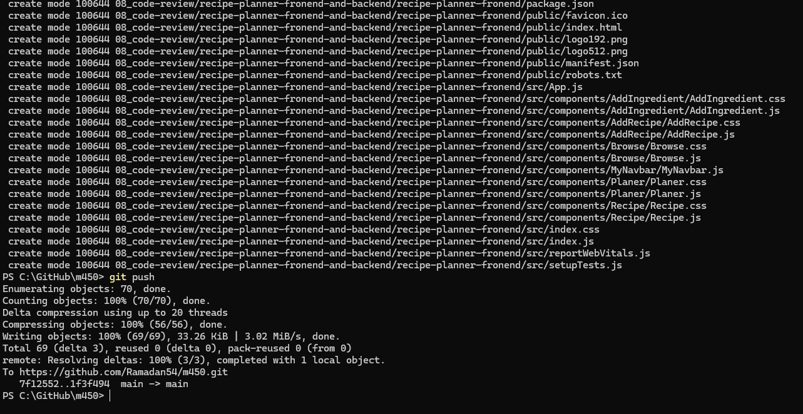

### Backend und Frontend starten

Das Backend wurde in IntelliJ mit JDK 17 gestartet und liefert unter `http://localhost:8080/api/recipes` 15 Test-Rezepte als JSON.

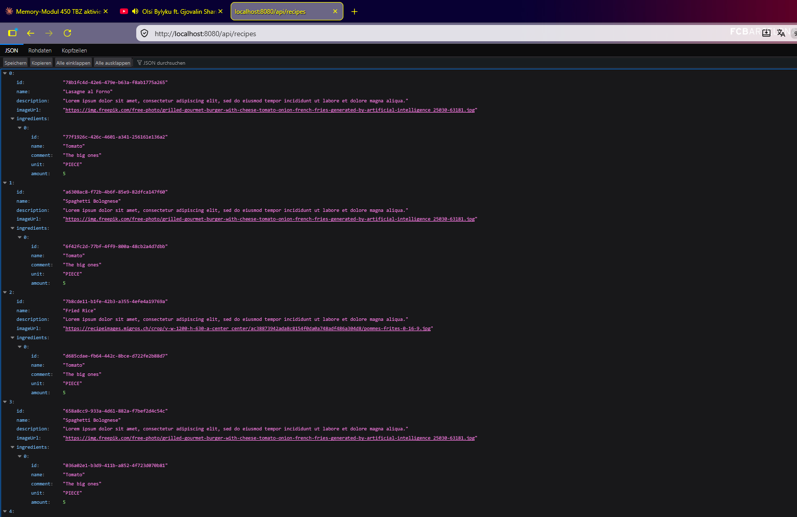

Beim Start des Frontends trat folgender Fehler auf:

```
[eslint] package.json » eslint-config-react-app/jest#overrides[0]:
Environment key "jest/globals" is unknown
```

**Ursache:** Das Projekt stammt von 2024. `npm install` lädt heute eine neuere Version des ESLint-Plugins für Jest, die die alte Einstellung `jest/globals` nicht mehr kennt. Die App selbst ist davon nicht betroffen.

**Lösung:** ESLint wird nur für den lokalen Start deaktiviert. So muss keine Projektdatei geändert werden und die Pull Requests enthalten nur die Feature-Änderungen.

```powershell
$env:DISABLE_ESLINT_PLUGIN="true"
npm start
```

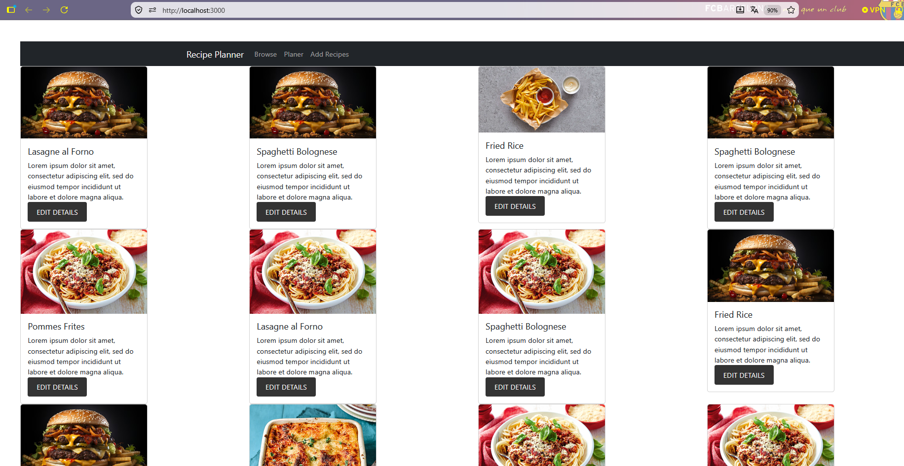

Die von `npm install` erzeugte `package-lock.json` wurde bewusst nicht committet, da sie nicht zum Feature gehört und den Pull Request um mehrere tausend Zeilen vergrössert hätte.

---

## 3. Aufgabe 1 – Neues Recipe hinzufügen

**Branch:** `feature/add-recipe`
**Pull Request:** #1

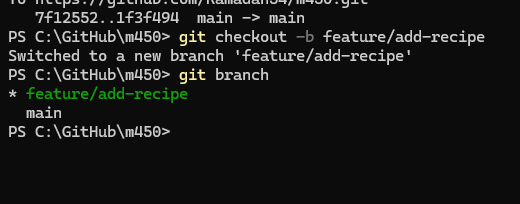

### Ausgangslage

Die Seite „Add Recipes“ war als Formular vorhanden, hatte aber keine Funktion. Beim Klick auf Submit wurde kein Request an das Backend gesendet und das Rezept wurde nicht gespeichert.

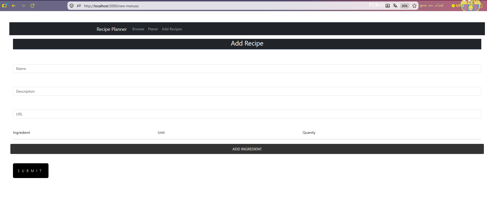

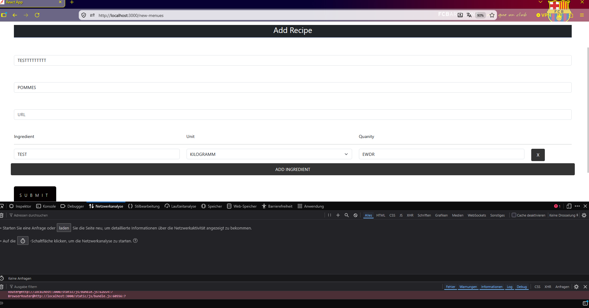

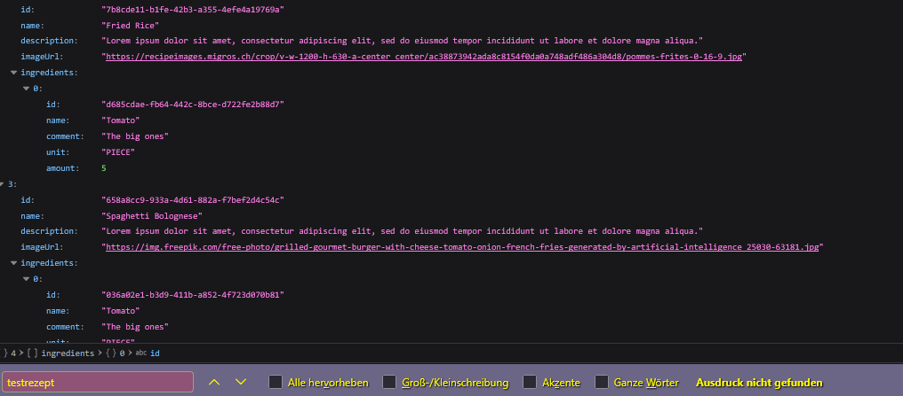

### Analyse

Bei der Analyse des Codes habe ich folgende Ursachen gefunden:

| Datei | Problem |
|---|---|
| `AddRecipe.js` | Eingabefelder haben kein `value` und kein `onChange`, die Eingaben landen nirgends |
| `AddRecipe.js` | Der Submit-Button steckt in keinem `<Form>` mit `onSubmit`, der Klick löst nichts aus |
| `AddRecipe.js` | `axios` wird importiert, aber nie verwendet, es gibt keinen POST an das Backend |
| `AddRecipe.js` | Unbenutzter Code: `useForm` und der State `ingredients` |
| `AddIngredient.js` | Die Zutatenfelder sind nicht verbunden, `updateIngredient` wird nie aufgerufen |
| `AddIngredient.js` | Feldnamen passen nicht zum Backend (`ingredient`/`quantity` statt `name`/`amount`) |
| `AddIngredient.js` | Bei Quantity kann Text eingegeben werden, obwohl das Backend eine Zahl erwartet |

Der POST-Endpoint `POST /api/recipes` existierte im Backend bereits. Für Aufgabe 1 waren deshalb nur Änderungen im Frontend nötig.

### Umsetzung

**AddRecipe.js**
- Eingabefelder über `name`, `value` und eine gemeinsame `handleChange`-Funktion mit dem State `formData` verbunden
- `<Form onSubmit={handleSubmit}>` ergänzt
- Validierung: Rezeptname ist Pflicht, jede Zutat braucht einen Namen und eine Menge grösser als 0
- Die Daten werden in das Backend-Format umgewandelt (`amount` als Zahl, `listId` wird nicht mitgesendet) und per `axios.post` gesendet
- Nach erfolgreichem Speichern Weiterleitung auf die Browse-Seite, bei Fehlern eine rote Meldung (`Alert`)
- Unbenutzten Code entfernt (Prinzip YAGNI) und den doppelten State `ingredients` entfernt (Prinzip DRY)
- Tippfehler „Quanity“ korrigiert

**AddIngredient.js**
- Felder mit `updateIngredient` verbunden
- Feldnamen an das Backend angepasst
- Quantity als Zahlenfeld (`type="number"`)
- Eindeutige `controlId` pro Zutatenzeile (vorher hatten alle Zeilen dieselbe ID)

### Tests

**Rezept speichern:** Beim Submit wird ein POST an das Backend gesendet, das mit Status 200 antwortet.

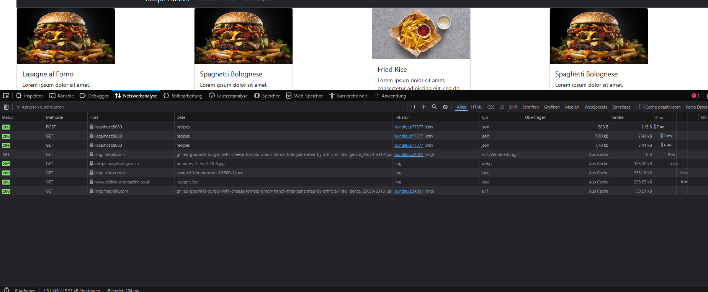

Das neue Rezept erscheint auf der Browse-Seite …

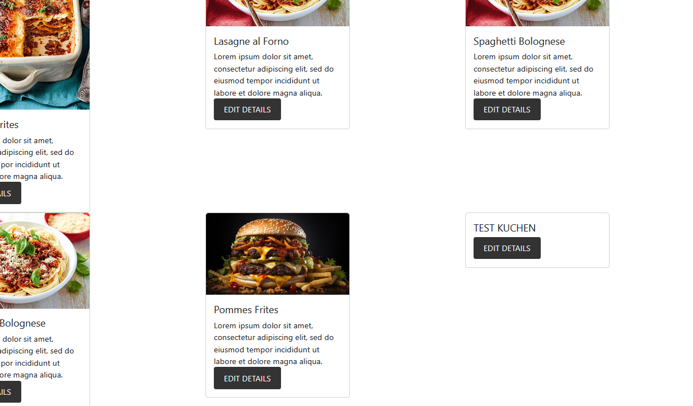

… und im Backend. Die Menge wird korrekt als Zahl gespeichert.

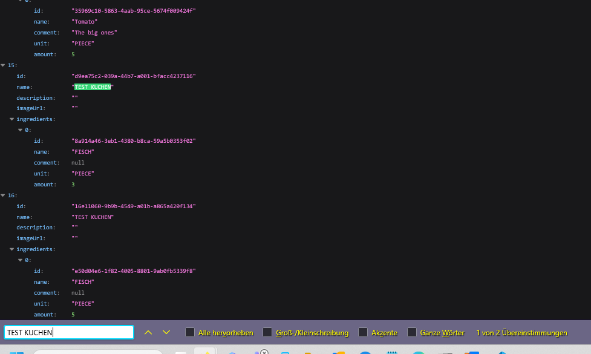

**Validierung:** Ohne Rezeptnamen oder ohne Menge bei einer Zutat erscheint eine Fehlermeldung und es wird nichts gespeichert.

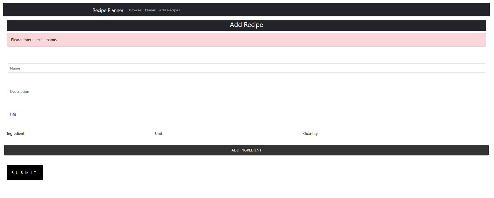

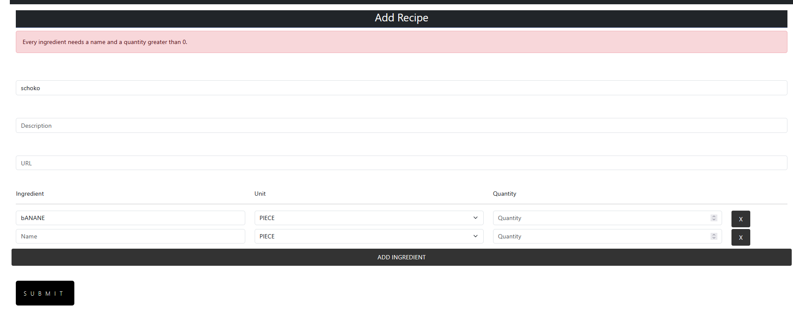

### Pull Request

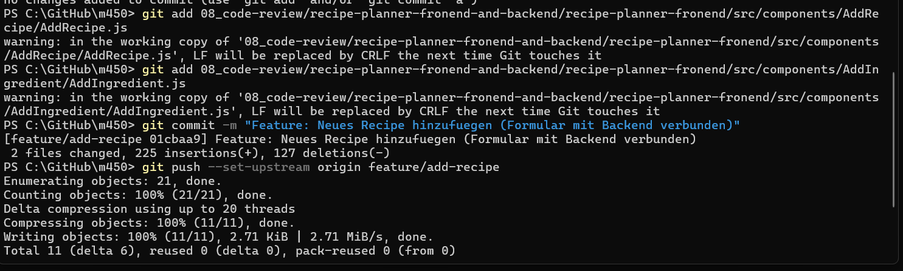

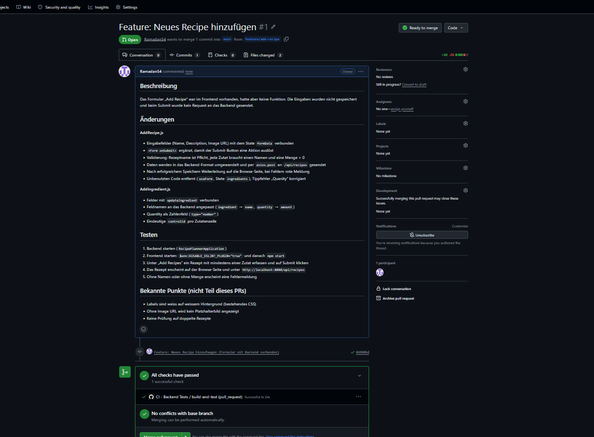

Der erste Versuch zeigte im Diff **225 hinzugefügte und 127 entfernte Zeilen**, obwohl nur wenige Zeilen fachlich geändert wurden. Grund war die automatische Formatierung von VS Code beim Speichern (einfache wurden zu doppelten Anführungszeichen, Einrückung von 4 auf 2 Leerzeichen, jedes Attribut auf einer eigenen Zeile).

Da der Pull Request noch nicht erstellt war, habe ich die Dateien im Originalstil neu eingespielt und den Commit mit `git commit --amend` und `git push --force-with-lease` ersetzt. Danach zeigte der Diff nur noch die echten Änderungen: **68 hinzugefügte und 26 entfernte Zeilen**.

---

## 4. Aufgabe 2 – Recipe bearbeiten

Aufgabe 2 betrifft Frontend und Backend. Dafür gibt es zwei getrennte Branches und zwei Pull Requests.

### 4.1 Backend

**Branch:** `feature/edit-recipe-backend` (von `main`)
**Pull Request:** #2

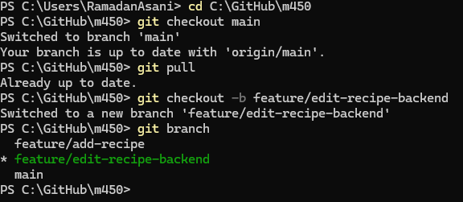

#### Ausgangslage

Im Backend gab es nur Endpoints zum Lesen (`GET`) und Erstellen (`POST`), aber keinen zum Bearbeiten.

#### Umsetzung

**RecipeController.java**
- Neuer Endpoint `PUT /api/recipes/recipe/{recipeId}`, gleich aufgebaut wie der bestehende GET für ein einzelnes Rezept
- Antwortet mit `200 OK` und dem aktualisierten Rezept
- Antwortet mit `404 Not Found`, wenn die ID nicht existiert

**RecipeService.java**
- Neue Methode `updateRecipe(UUID recipeId, Recipe recipe)`
- Prüft zuerst, ob das Rezept existiert
- Die ID aus der URL wird übernommen, damit über den Body kein anderes Rezept überschrieben werden kann

Es wurde nur Code hinzugefügt, bestehender Code blieb unverändert (**19 hinzugefügte Zeilen, 0 entfernt**).

#### Gefundener Fehler im bestehenden Code

Beim ersten Build trat folgender Fehler auf:

```
java: incompatible types: java.util.UUID cannot be converted to java.lang.Long
```

Das `RecipeRepository` ist mit dem ID-Typ `Long` deklariert, obwohl die Rezepte eine `UUID` als ID haben:

```java
public interface RecipeRepository extends CrudRepository<RecipeEntity, Long> {
    Optional<RecipeEntity> findById(UUID id);
```

Eingebaute Methoden wie `existsById` erwarten deshalb eine `Long`. Ich habe stattdessen die bereits vorhandene Methode `findById(UUID)` verwendet. Die korrekte Lösung (`CrudRepository<RecipeEntity, UUID>`) gehört nicht zu diesem Feature und ist im Pull Request als bekannter Punkt vermerkt.

#### Tests mit Postman

**PUT mit bestehender ID:** Status 200, die ID bleibt gleich, Name, Beschreibung, Bild und Zutaten sind geändert.

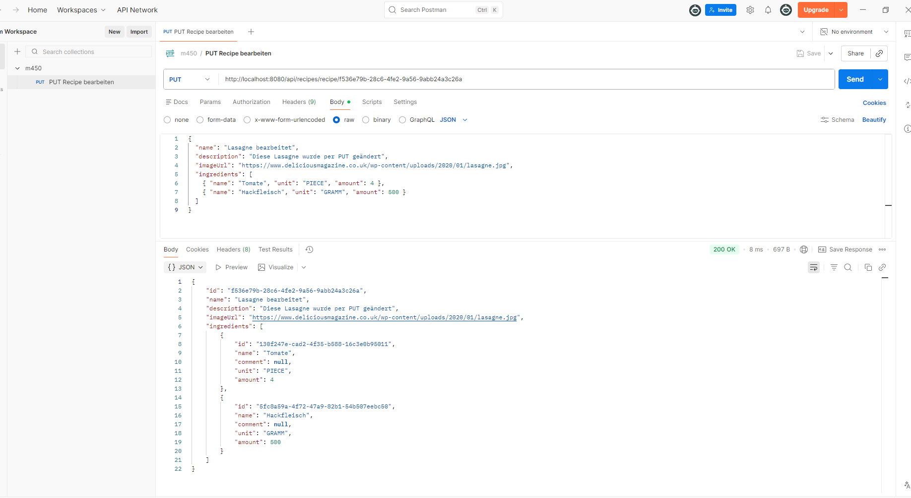

**PUT mit nicht existierender ID** (`00000000-0000-0000-0000-000000000000`): Status 404, es wird kein neues Rezept angelegt.

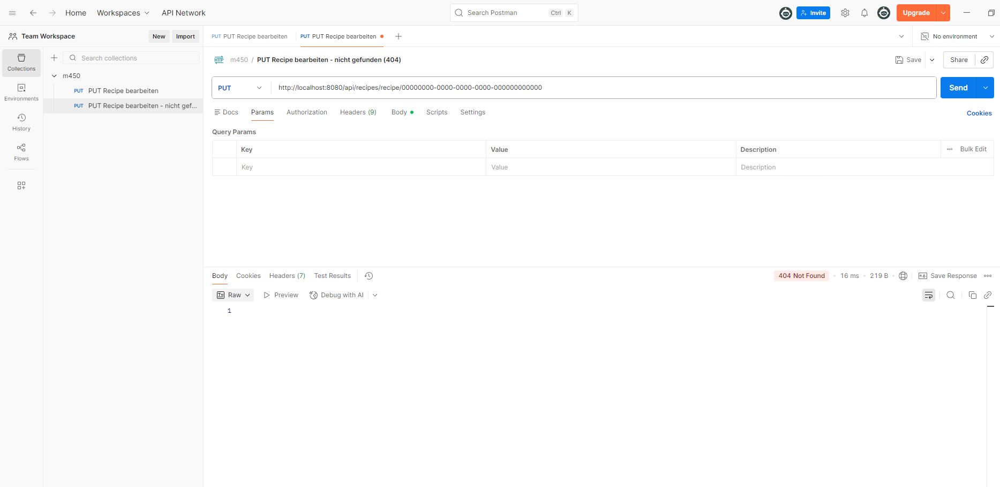

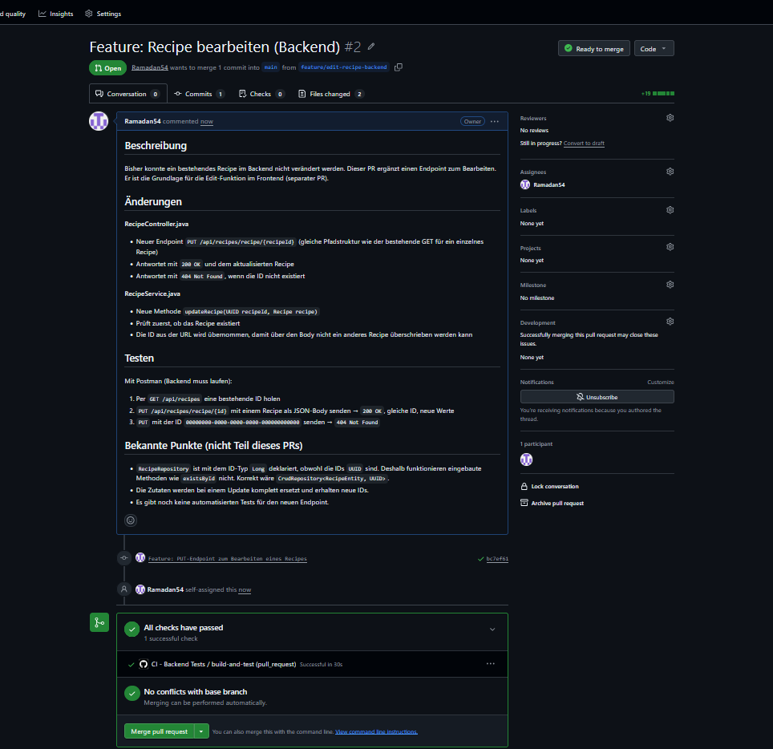

### 4.2 Frontend

**Branch:** `feature/edit-recipe-frontend` (von `feature/add-recipe`)
**Pull Request:** #3 (Base: `feature/add-recipe`)

#### Ausgangslage

Der Button „Edit Details“ auf den Rezeptkarten hatte keine Funktion.

#### Entscheidung: gestapelter Pull Request

Das Bearbeitungsformular sieht gleich aus wie das Formular zum Hinzufügen. Statt eine zweite, fast identische Seite zu erstellen, wird `AddRecipe` wiederverwendet (Prinzip DRY). Dafür braucht der Branch das funktionierende Formular aus Aufgabe 1.

Der Branch startet deshalb von `feature/add-recipe` und der Pull Request zeigt auf `feature/add-recipe` statt auf `main`. So sieht der Reviewer nur die Änderungen für das Bearbeiten. Nach dem Merge von #1 stellt GitHub die Base automatisch auf `main` um.

#### Umsetzung

**AddRecipe.js**
- Enthält die URL eine `recipeId`, wird das Rezept per `GET /api/recipes/recipe/{id}` geladen und das Formular vorausgefüllt
- Überschrift „Edit Recipe“ statt „Add Recipe“
- Beim Submit wird im Bearbeitungsmodus `PUT` statt `POST` gesendet
- Fehlermeldung, falls das Rezept nicht geladen werden kann

**App.js**
- Neue Route `/edit/:recipeId`
- Beide Routen haben einen eigenen `key`, damit das Formular beim Wechsel von Bearbeiten zu Hinzufügen zurückgesetzt wird

**Browse.js**
- Rezept-ID wird an die Karte weitergegeben
- Fehlender `key` bei der Kartenliste ergänzt (React-Warnung)

**Recipe.js**
- „Edit Details“ navigiert auf `/edit/{id}`

Umfang: **48 hinzugefügte und 8 entfernte Zeilen** in 4 Dateien.

#### Tests

Nach dem Klick auf „Edit Details“ öffnet sich das Formular mit der ID in der URL und ist mit den Daten des Rezepts vorausgefüllt.

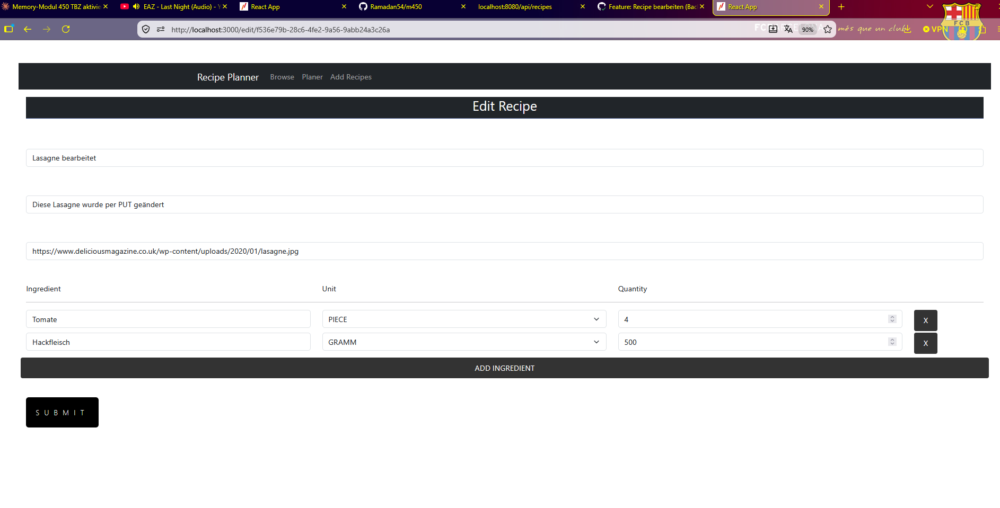

Nach dem Ändern und Speichern wird ein PUT auf die Rezept-ID gesendet (Status 200). Die Änderung ist auf der Browse-Seite sichtbar.

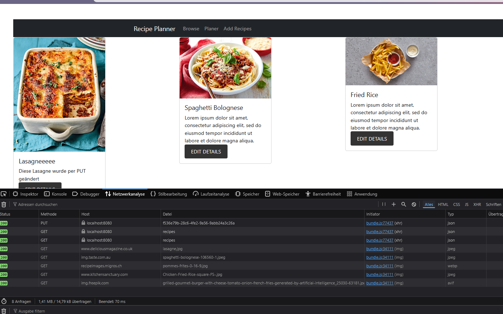

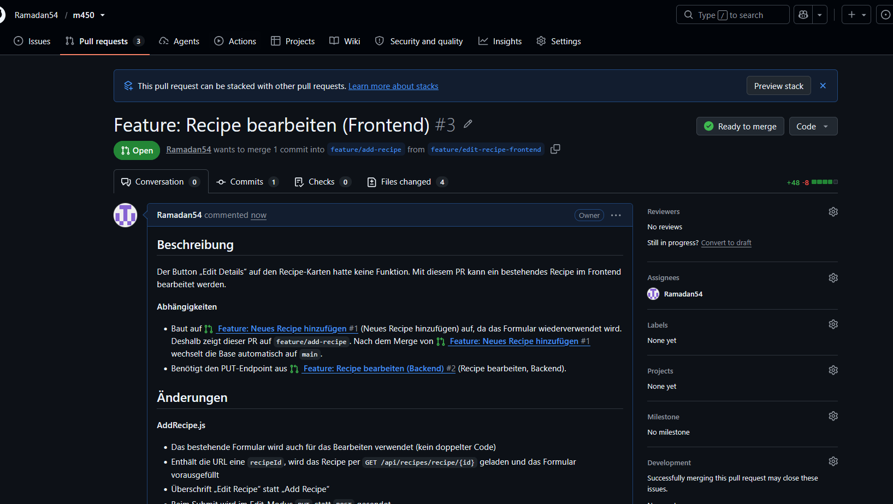

---

## 5. Übersicht der Pull Requests

| PR | Titel | Branch | Base | Umfang |
|---|---|---|---|---|
| #1 | Feature: Neues Recipe hinzufügen | `feature/add-recipe` | `main` | +68 / −26 |
| #2 | Feature: Recipe bearbeiten (Backend) | `feature/edit-recipe-backend` | `main` | +19 / −0 |
| #3 | Feature: Recipe bearbeiten (Frontend) | `feature/edit-recipe-frontend` | `feature/add-recipe` | +48 / −8 |

Alle Pull Requests liegen unter der Empfehlung von 200 bis 400 geänderten Zeilen und sind damit in einem Review gut überschaubar. Die CI-Pipeline aus Block 7 läuft bei jedem Pull Request automatisch und war bei allen erfolgreich.

Geplante Merge-Reihenfolge nach dem Review: **#1 → #2 → #3**

---

## 6. Erkenntnisse aus der Umsetzung

### Zum Ablauf mit Pull Requests

- **Den Ausgangsstand zuerst auf `main` legen.** Sonst zeigt der Pull Request das ganze Projekt als neu an und ist nicht reviewbar.
- **Automatische Formatierung vergrössert den Diff massiv.** Durch die Formatierung beim Speichern stieg der Umfang von 68/26 auf 225/127 Zeilen, und die echten Änderungen waren kaum noch zu finden. Formatierungsänderungen sollten in einem eigenen Pull Request erfolgen oder im Team einheitlich eingestellt sein.
- **Nur das committen, was zum Feature gehört.** `package-lock.json` und Screenshots wurden bewusst nicht in die Feature-Pull-Requests aufgenommen.
- **Kleine Pull Requests.** Durch die Aufteilung in drei Pull Requests (Frontend Add, Backend Edit, Frontend Edit) bleibt jeder einzelne überschaubar.
- **Abhängigkeiten sichtbar machen.** Mit einem gestapelten Pull Request und Verweisen auf #1 und #2 in der Beschreibung ist klar, was voneinander abhängt.
- **Eine gute Beschreibung hilft dem Reviewer.** Jede Beschreibung enthält, was geändert wurde, wie man es testet und welche Punkte bewusst nicht Teil des Pull Requests sind.

### Gefundene Punkte für Follow-up-Tickets

Diese Punkte sind beim Umsetzen aufgefallen, gehören aber nicht zu den Features. Laut Theorie sollen solche Vorschläge separat als Follow-up-Ticket oder -PR umgesetzt werden, damit die Nacharbeiten den Rahmen nicht sprengen.

| Bereich | Punkt |
|---|---|
| Backend | `RecipeRepository` verwendet `Long` statt `UUID` als ID-Typ |
| Backend | Zutaten erhalten bei jedem Update neue IDs, weil sie komplett ersetzt werden |
| Backend | Keine automatisierten Tests für die Endpoints |
| Backend | Keine Prüfung auf doppelte Rezepte |
| Frontend | Labels im Formular sind weiss auf weissem Hintergrund (bestehendes CSS) |
| Frontend | Ohne Image URL wird kein Platzhalterbild angezeigt |
| Frontend | Die Fehlermeldung bei Zutaten sagt nicht, welche Zeile betroffen ist, und leere Zeilen blockieren das Speichern |
| Frontend | Kein Kommentarfeld für Zutaten, obwohl das Backend eines kennt |
| Frontend | Rezepte können nicht gelöscht werden |
| Frontend | ESLint-Konfiguration ist mit aktuellen Paketversionen nicht kompatibel |

---

## 7. Code-Review

> Dieses Kapitel wird nach dem Review ergänzt.

### 7.1 Reviewer

_Wird ergänzt._

### 7.2 Erhaltene Kommentare zu meinen Pull Requests

| PR | Kommentar | Meine Reaktion |
|---|---|---|
| | | |

### 7.3 Meine Kommentare zu den Pull Requests des Partners

| PR | Kommentar |
|---|---|
| | |

### 7.4 Vergleich und Diskussion

_Wird ergänzt._

### 7.5 Erkenntnisse aus dem Review

_Wird ergänzt._
